# 功能展示

bili-sync 是一个功能完善的 B站视频同步下载工具，提供现代化的 Web 管理界面和全面的功能支持。

## 🏠 系统主页

系统仪表板一览：
- 📊 **存储监控**：97.42 TB 可用空间实时显示
- 👥 **最近人员**：显示管理的UP主列表
- 🔄 **任务状态**：29个下载任务进度监控
- 📈 **性能图表**：存储和CPU使用率可视化
- 🎯 **快速入口**：各功能模块快速访问

## 📁 视频源管理

### 视频源总览
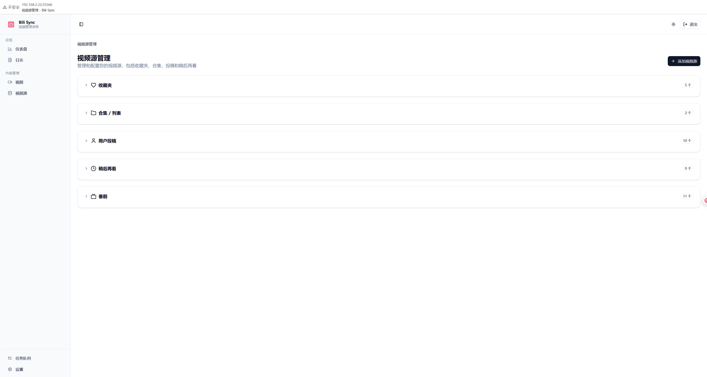

全面的视频源类型支持：
- 📚 **收藏夹**：5个收藏夹管理
- 📺 **合集/列表**：4个视频合集
- 👤 **用户投稿**：10个UP主订阅
- ⏰ **稍后再看**：实时同步列表
- 🎭 **番剧**：11部番剧管理

### 添加视频源

#### UP主投稿订阅

- 输入UP主ID即可订阅
- 自动获取所有投稿视频
- 支持增量更新

#### 收藏夹订阅

- 自动获取用户所有收藏夹
- 可视化选择界面
- 显示收藏夹详细信息

#### 合集订阅
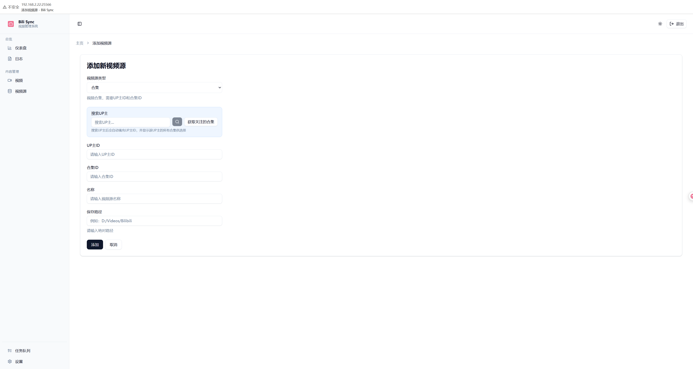
- 支持UP主视频合集
- 通过合集ID添加
- 批量管理功能

#### 番剧订阅

- Season ID添加方式
- 单季/全季下载模式
- 自动生成NFO元数据

#### 稍后再看
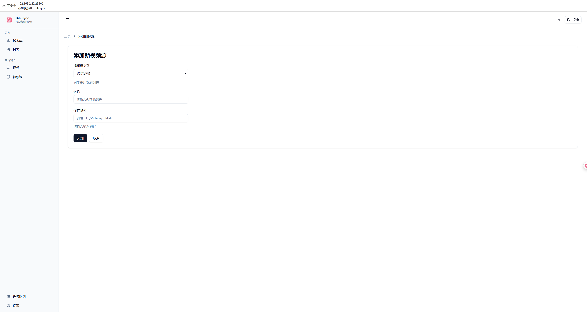
- 最简单的配置方式
- 实时同步B站列表
- 自动清理已观看

### 高级功能
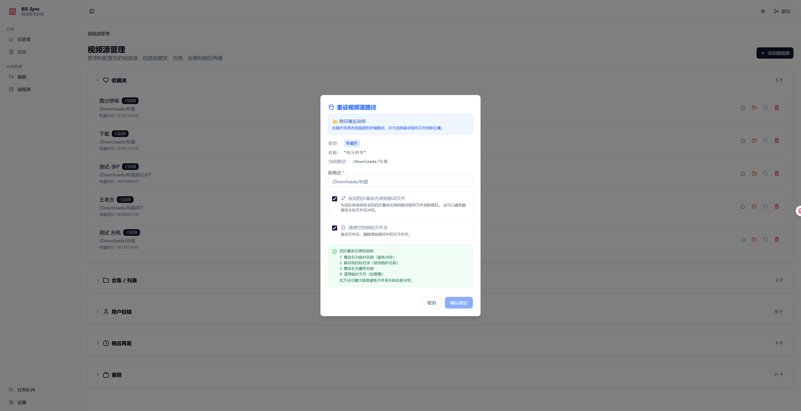
- 批量修改下载路径
- 路径映射功能
- 灵活的存储管理

## 🎬 视频管理

已下载视频浏览：
- 🖼️ **网格布局**：视频封面缩略图展示
- 📊 **信息展示**：标题、UP主、播放进度
- 🔍 **搜索筛选**：快速定位目标视频
- 🎯 **批量操作**：多选管理功能

## ⚙️ 系统设置

### 设置中心

完整的配置管理：
- 📝 文件命名设置
- 🎥 视频质量设置
- 💬 弹幕设置
- 🔑 B站凭证
- 🔍 扫描设置
- 🛡️ 风控设置
- 📥 Aria2监控
- 🎨 界面设置
- 📢 推送通知
- 🔧 系统设置

### 详细配置

#### 下载设置
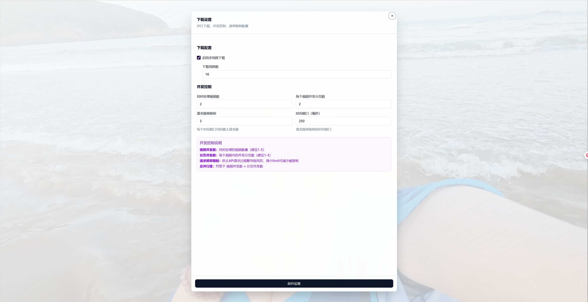
- 下载线程数配置
- 并发任务数调整
- 重试机制设置

#### 视频质量
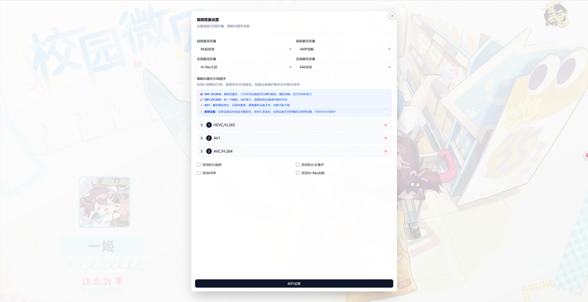
- 视频编码格式选择
- 分辨率优先级设置
- 音频质量配置

#### 文件命名
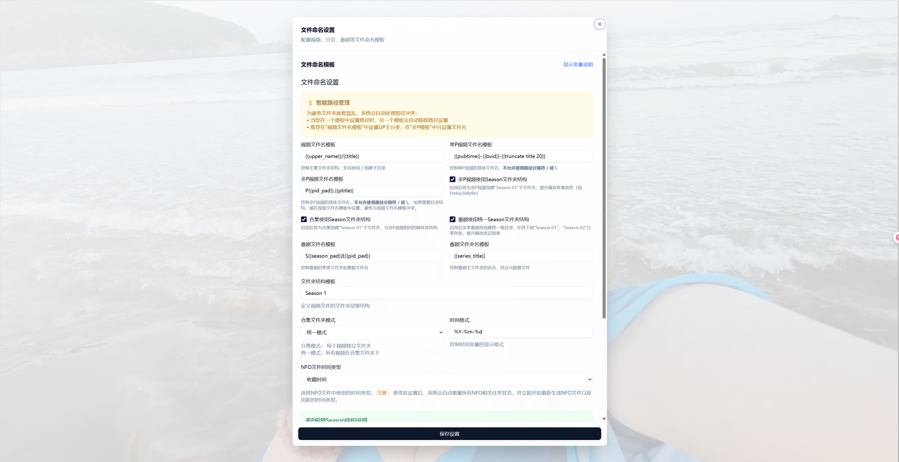
- 自定义命名模板
- 变量替换规则
- 预览命名效果

#### B站登录
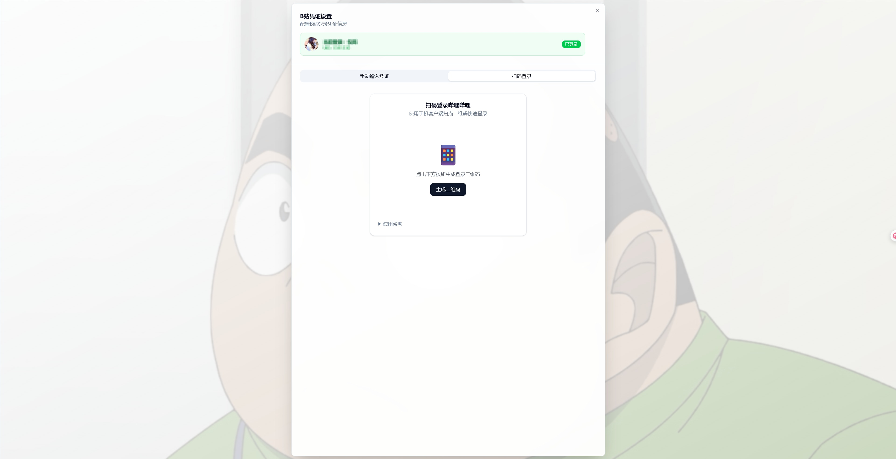
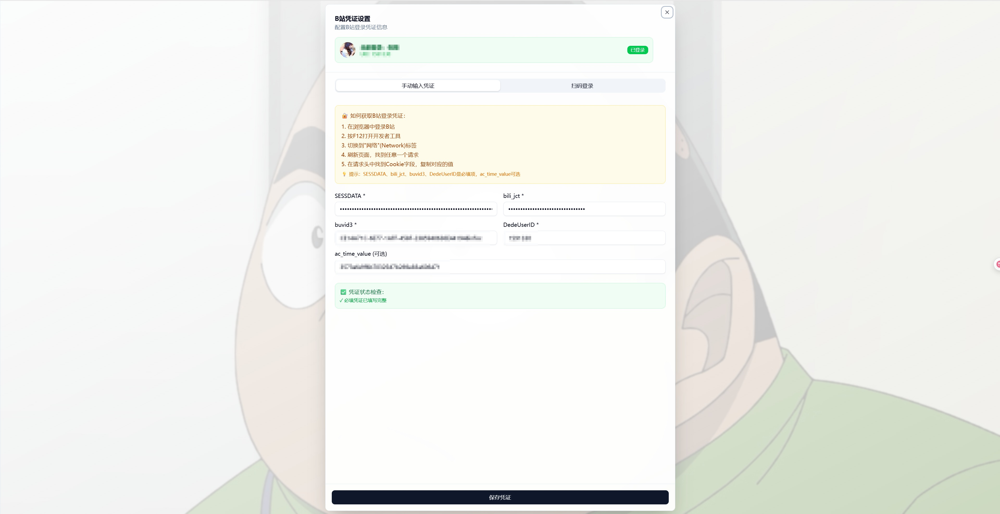
- 扫码登录支持
- Cookie手动配置
- 登录状态显示

#### 弹幕设置
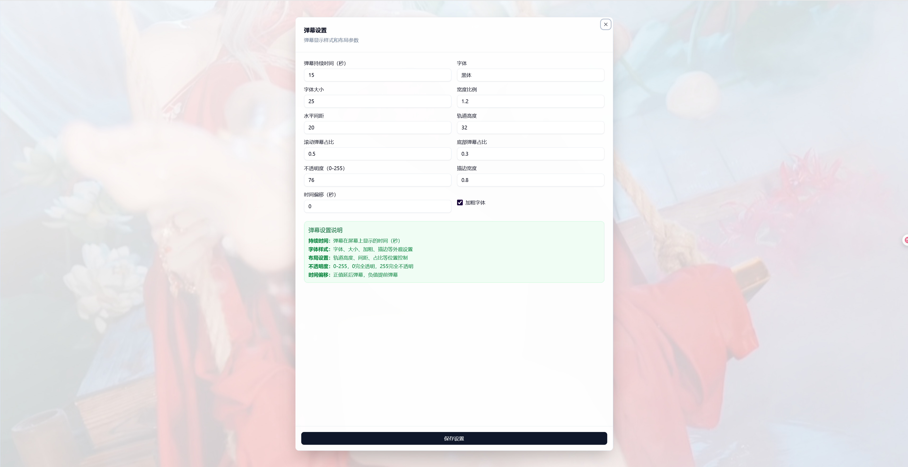
- 弹幕格式选择
- 字体大小调整
- 透明度设置

#### 界面主题
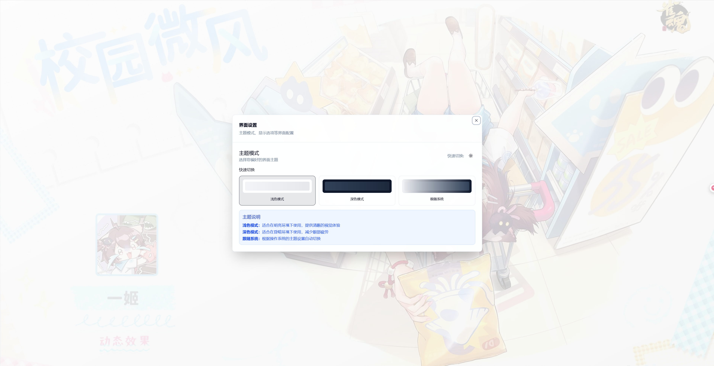
- 亮色/暗色模式切换
- 跟随系统主题
- 即时生效

#### 推送通知

- Server酱 / Bark 通知渠道
- 触发条件设置
- 测试推送功能

#### 风控设置
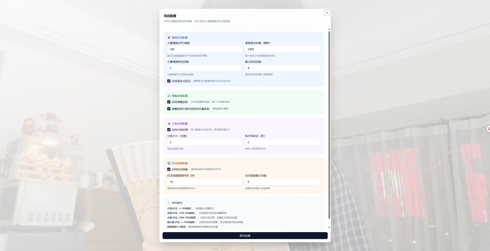
- 下载速度限制
- 请求频率控制
- 重试策略配置

#### Aria2配置
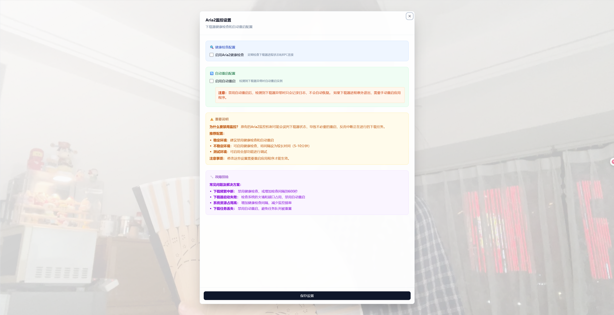
- 外部下载器集成
- RPC接口配置
- 下载任务监控

#### 系统配置
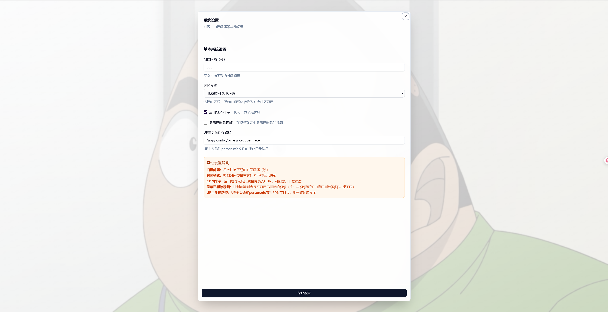
- 基础系统参数
- 数据库配置
- 日志级别设置

## 📊 运行监控

### 任务队列

任务管理中心：
- 🔄 **扫描队列**：实时扫描状态
- 🗑️ **删除队列**：批量删除管理
- ✅ **成功队列**：完成任务记录
- ⚙️ **配置队列**：系统配置任务

### 系统日志

实时日志监控：
- 📜 **时间戳记录**：精确到秒的日志
- 🏷️ **级别标识**：INFO/WARN/ERROR分类
- 📝 **详细信息**：完整的操作记录
- 🔍 **日志筛选**：按级别过滤查看

## 🚀 核心特性

### 功能完整性
- ✅ 支持所有B站视频源类型
- ✅ 完善的任务队列管理
- ✅ 灵活的配置系统
- ✅ 实时日志监控

### 用户体验
- 🎯 直观的Web界面
- 📊 丰富的数据可视化
- 🔔 完善的通知系统
- 🎨 深色模式支持

### 技术优势
- 🦀 Rust开发，高性能
- 🔄 增量同步，省资源
- 📦 完整元数据支持
- 🐳 Docker容器部署

## 📖 快速开始

1. **访问系统**：`http://127.0.0.1:12345`
2. **配置登录**：扫码或输入Cookie
3. **添加视频源**：选择需要的内容类型
4. **开始同步**：系统自动管理下载

bili-sync - 您的B站视频库完美解决方案！