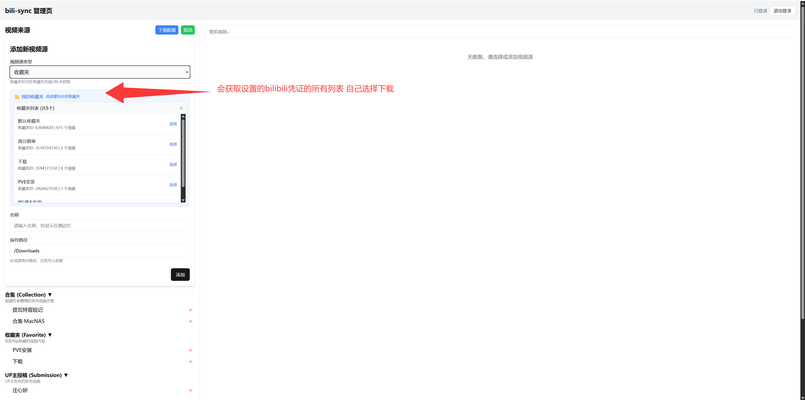
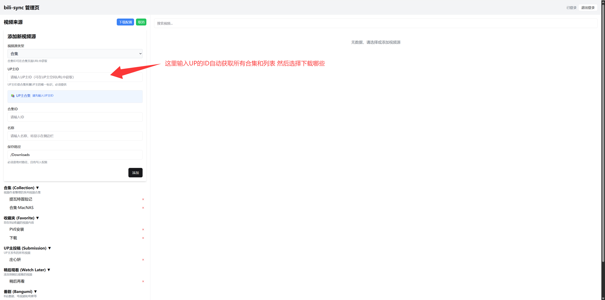
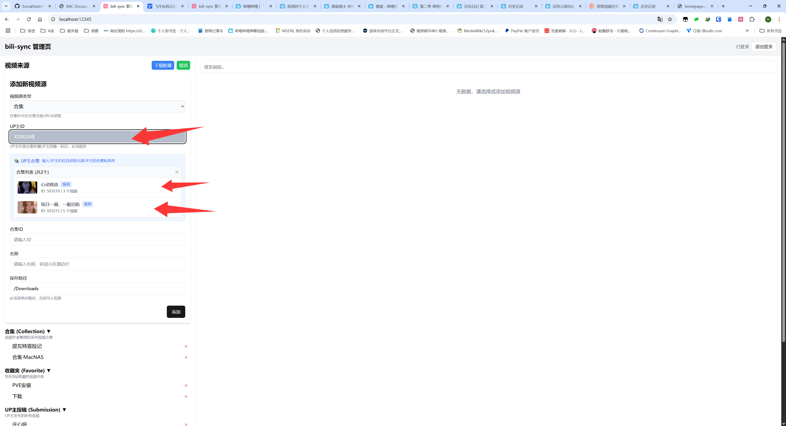
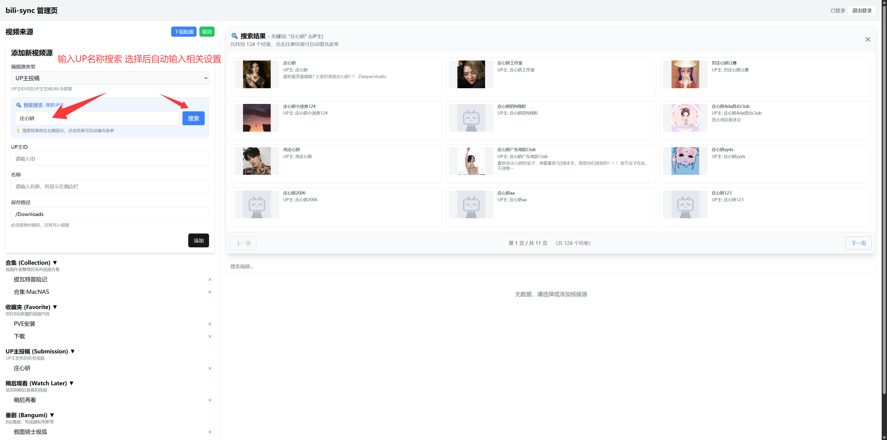
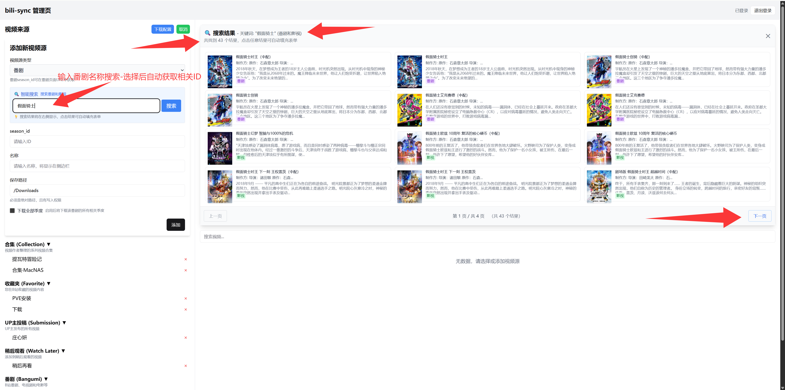
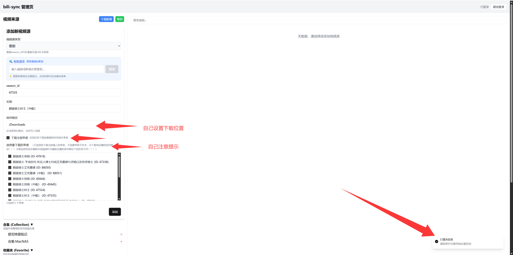

# 功能展示

bili-sync 提供了强大而易用的视频源管理功能，以下是最新版本的功能截图展示。

## 📁 收藏夹管理

### 收藏夹选择界面

无需手动输入收藏夹ID，系统会自动加载并展示当前用户的所有收藏夹列表，支持一键选择：

- ✨ 自动显示收藏夹名称和视频数量
- 🔢 完整显示64位收藏夹ID，避免精度丢失
- 👆 点击即可快速选择并自动填充表单

## 🎬 UP主合集管理

### UP主合集列表

输入UP主ID后，系统会自动获取该UP主的所有合集和系列：

- 📚 支持显示合集和系列两种类型
- 🖼️ 展示合集封面、标题和视频数量
- 🎯 一键选择，自动识别合集类型

### 合集详情展示

选择合集后的详细信息：

## 🔍 搜索功能优化

### 搜索结果展示

搜索结果现在在右侧主内容区域展示，采用网格布局：

- 📐 4行×3列的网格布局，充分利用屏幕空间
- 🖼️ 智能处理缩略图，支持防盗链
- 📄 支持分页浏览，每页12个结果
- 🎯 点击即可自动填充表单信息

## 📺 番剧搜索增强

### 番剧搜索结果

番剧搜索支持同时显示番剧和影视内容：

- 🎭 同时搜索并展示番剧和影视内容
- 📺 智能识别内容类型（番剧/影视）
- 🖼️ 竖版海报展示，符合番剧特点

### 番剧详情

番剧的详细信息展示：

## 🎯 使用提示

1. **收藏夹功能**：选择"收藏夹"类型后，系统会自动加载您的收藏夹列表
2. **UP主合集**：输入UP主ID（可在UP主空间URL中找到），系统会自动获取其所有合集
3. **搜索功能**：搜索结果实时展示，支持视频、UP主、番剧等多种类型
4. **番剧下载**：支持单季和全季模式，可选择性下载特定季度

## 🚀 快速开始

1. 访问管理页面 `http://localhost:12345`
2. 使用配置文件中的 `auth_token` 登录
3. 点击"添加视频源"按钮
4. 根据需要选择视频源类型
5. 使用搜索或列表选择功能快速添加视频源

所有操作都在Web界面完成，无需手动编辑配置文件！ 