# bili-sync 是什么？

> **🎉 bili-sync 是一个用 Rust 语言编写的高性能哔哩哔哩视频同步下载工具！**
> 
> 当前最新程序版本为 v2.7.0，文档将始终与最新程序版本保持一致。

> [!IMPORTANT]
> **重大架构升级！** 从 v2.6.x 开始，视频源配置已完全迁移到数据库管理，并提供现代化的 Web 管理界面。如果您从旧版本升级，请参阅 [配置迁移指南](../MIGRATION_GUIDE.md)。

bili-sync 是一款专为 NAS 用户编写的哔哩哔哩同步工具，由 Rust & Tokio 驱动。

它的基本的工作原理是使用用户填写的凭据定期扫描视频合集、收藏夹等，获取到本地未下载过的内容并保存到本地，维持本地视频库与哔哩哔哩网站的同步。

下载的内容包括视频、封面、弹幕、标签与简介信息等，这些文件整体保持与 Emby、Jellyfin 等媒体服务器软件兼容的文件布局，使得目的文件夹可以直接被作为媒体库添加到这些软件中，无需干预自动识别。

## 🌟 版本亮点 (v2.7.0)

### 🛡️ **删除任务队列系统** - 全新并发安全机制
- **智能冲突检测**：自动检测扫描状态，避免删除-扫描冲突
- **任务队列管理**：扫描期间的删除请求自动排队等待
- **无感知体验**：用户随时删除，系统智能协调处理时机

### ⚙️ **配置文件完全兼容** - 升级无忧
- **向后兼容修复**：解决配置字段缺失导致的启动失败
- **自动默认值**：新增字段自动补全默认配置
- **平滑升级**：任何旧版本都能无缝升级到最新版

### 📚 **技术文档体系** - 完善的开发者支持
- **系统架构说明**：详细的删除队列系统实现文档
- **API使用指南**：完整的接口调用示例和说明
- **迁移指南**：详细的版本升级和配置迁移说明

## 🎯 核心优势

- **高性能**：Rust + Tokio 异步并发，下载速度极快
- **智能管理**：现代化 Web 界面，视频源统一管理
- **安全可靠**：并发冲突检测，数据安全保障  
- **版本升级**：v2.6.2 → v2.7.0

## 🖼️ 新版 Web 界面展示

### 管理首页
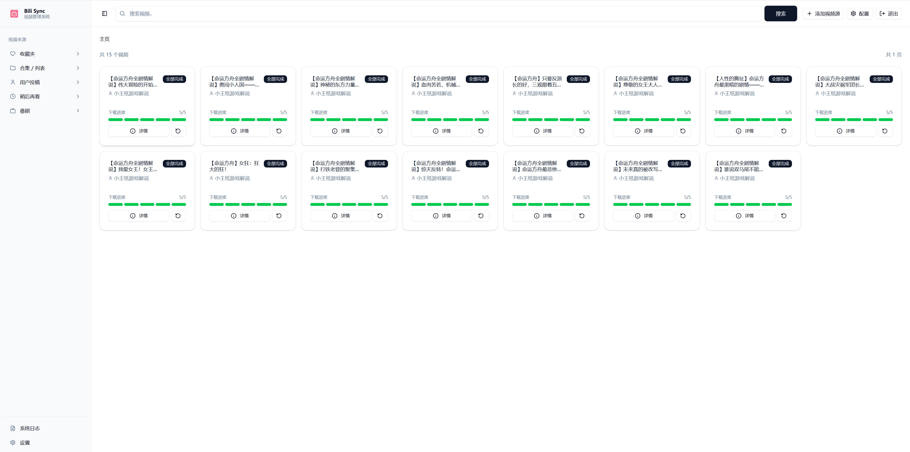

现代化的管理首页，清晰展示系统状态和快速操作入口。

### 视频源管理

#### 收藏夹管理
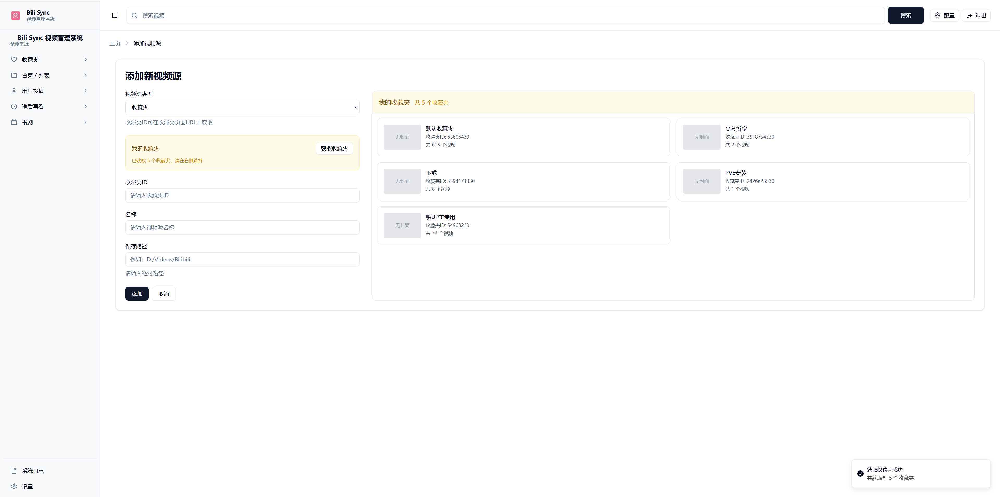

自动获取并显示用户所有收藏夹，支持一键选择，无需手动输入ID。

#### UP主投稿
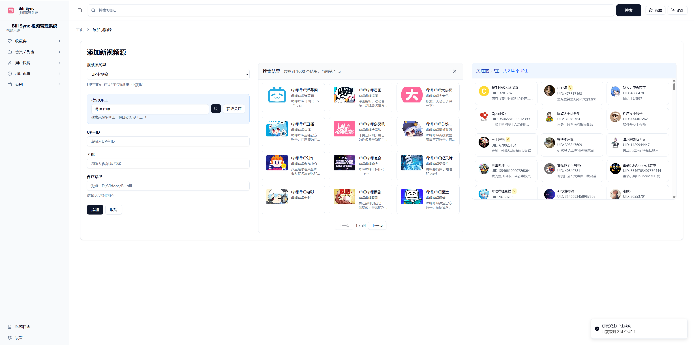

输入UP主ID即可管理其投稿视频下载。

#### 合集管理
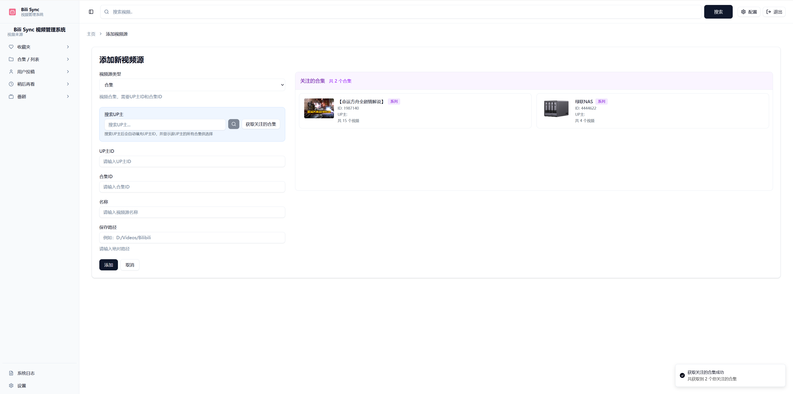

支持UP主合集和系列的完整管理。

#### 番剧下载
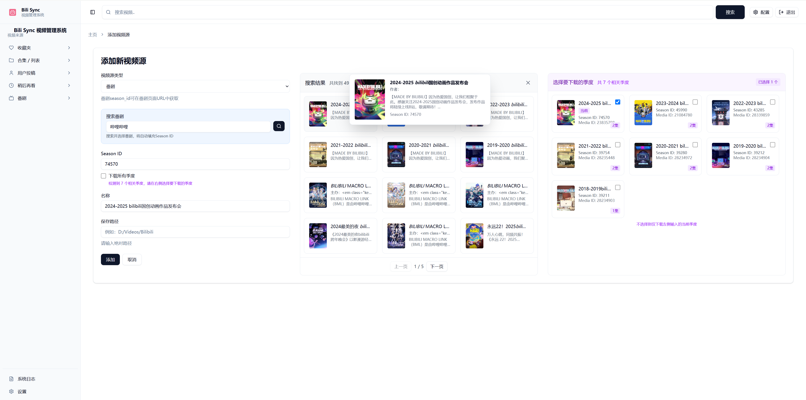

完整支持番剧下载，包括单季和全季模式。

#### 稍后再看
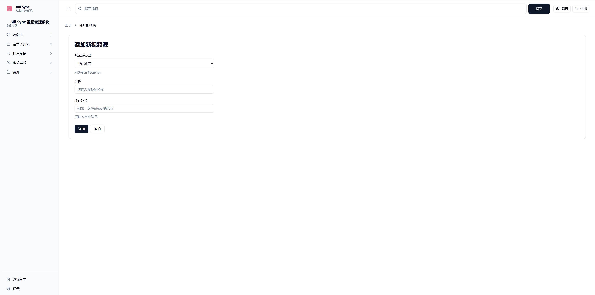

方便的稍后再看列表管理。

### 系统功能

#### 系统设置
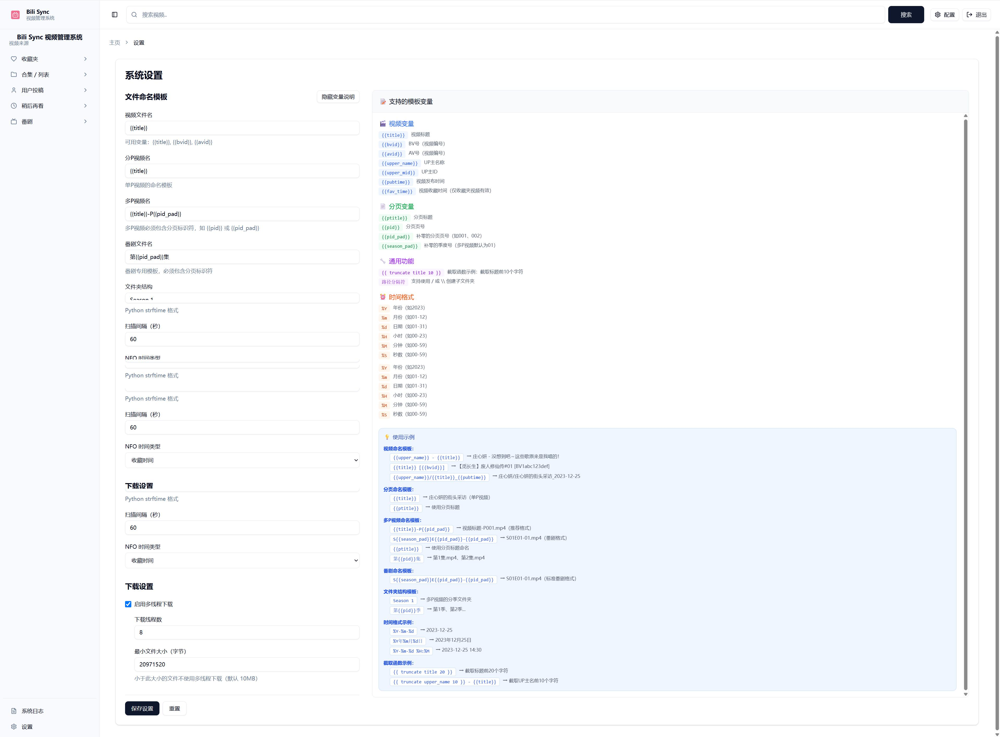

可视化的系统配置界面，支持实时修改配置参数。

#### 视频详情
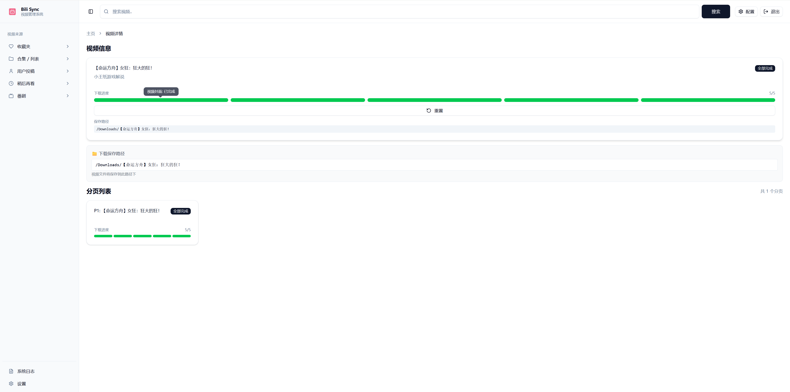

详细的视频信息展示和管理功能。

#### 日志查看
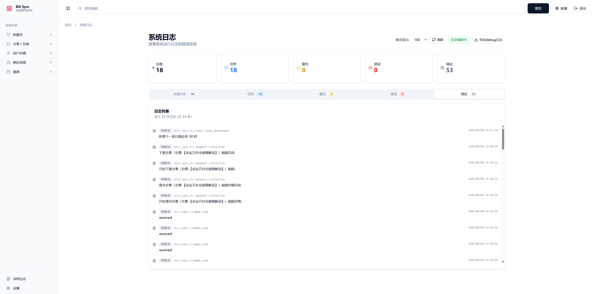

实时日志查看，方便问题排查和系统监控。

#### 强制重置
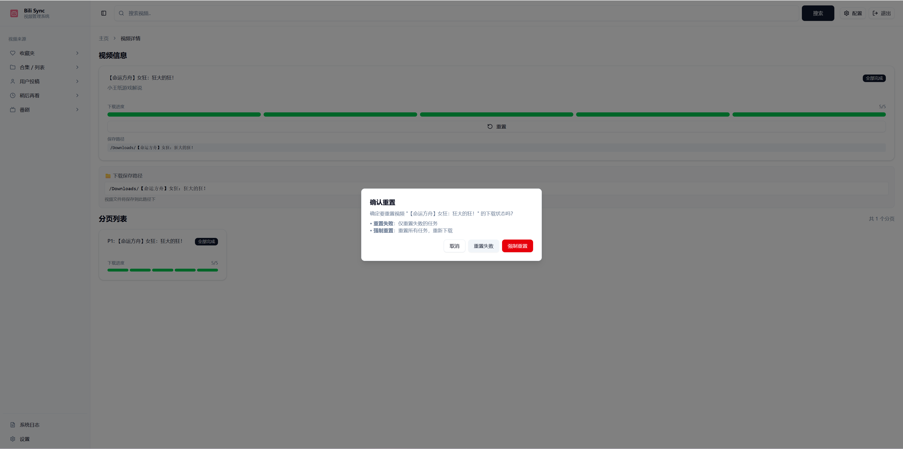

安全的系统重置功能。

#### 视频源删除
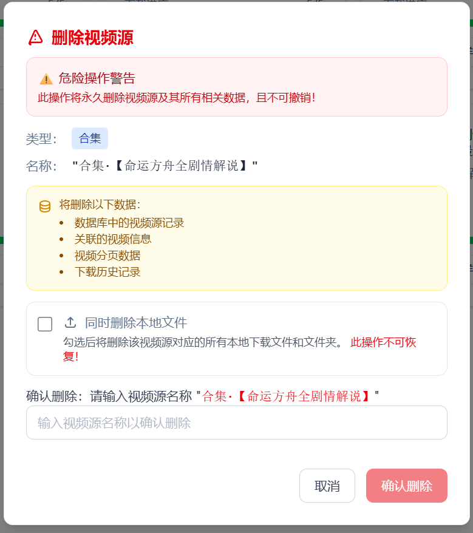

便捷的视频源删除管理。

## 使用截图

> [!WARNING]
> 媒体库类型请选择"混合内容"，否则可能导致多页视频无法正常显示。

### 概览

### 详情

### 播放（使用 infuse）

### 文件排布

## 功能与路线图

### 🎯 核心功能
- [x] 使用用户填写的凭据认证，并在必要时自动刷新
- [x] **可以在管理页面 `0.0.0.0:12345` 内添加视频源** 🆕
- [x] 支持收藏夹与视频列表/视频合集的下载
- [x] **支持直接显示和选择用户收藏夹，无需手动输入ID** 🆕
- [x] **支持UP主合集列表展示和快速选择** 🆕
- [x] **支持番剧的下载，包括单季模式和全季模式** 🆕
- [x] 自动选择用户设置范围内最优的视频和音频流，并在下载完成后使用 FFmpeg 合并
- [x] 使用 Tokio 与 Reqwest，对视频、视频分页进行异步并发下载
- [x] 使用媒体服务器支持的文件命名，方便一键作为媒体库导入
- [x] 当前轮次下载失败会在下一轮下载时重试，失败次数过多自动丢弃
- [x] 使用数据库保存媒体信息，避免对同个视频的多次请求
- [x] 打印日志，并在请求出现风控时自动终止，等待下一轮执行
- [x] 提供多平台的二进制可执行文件，为 Linux 平台提供了立即可用的 Docker 镜像
- [x] 支持对"稍后再看"内视频的自动扫描与下载
- [x] 支持对 UP 主投稿视频的自动扫描与下载
- [x] 支持限制任务的并行度和接口请求频率

### 🚀 新增特性 (v2.7.0)

- [x] **🛡️ 删除任务队列系统** - 智能检测扫描状态，删除操作自动排队，避免并发冲突
- [x] **⚙️ 配置文件完全兼容** - 修复向后兼容性问题，任何旧版本配置都能无缝升级
- [x] **📚 技术文档体系完善** - 提供详细的系统架构说明和API使用指南
- [x] **🔧 VitePress文档站点** - 修复构建问题，支持在线技术文档访问
- [x] **⭐ 并发安全保障** - 扫描和删除操作的智能协调，数据完整性保护
- [x] **🚀 用户体验优化** - 删除操作无感知，系统自动处理最佳时机
- [x] **Web 管理界面增强** - 通过友好的 Web 界面直接管理视频源，无需手动编辑配置文件
- [x] **收藏夹管理优化** - 自动获取并显示用户所有收藏夹，支持快速选择，解决ID精度问题
- [x] **UP主合集支持** - 输入UP主ID即可查看其所有合集和系列，支持一键选择添加

### 🔄 持续改进
- [x] **项目结构优化** - 更清晰的代码组织和技术栈说明
- [x] **UI 组件扩展** - 新增对话框、标签、选择器等交互组件
- [x] **搜索界面优化** - 搜索结果展示从左侧移至右侧主区域，支持网格布局和分页
- [x] **数据库兼容性** - 修复旧版本数据库升级问题，自动添加缺失的字段
- [x] **ID精度处理** - 解决JavaScript大数字精度问题，确保64位ID正确处理
- [x] **配置管理增强** - 统一的 `config.toml` 配置文件，支持运行时修改（不再包含视频源）
- [x] **文档和开发体验** - 详细的快速开始指南和贡献指南
- [x] **错误处理改进** - 修复多个关键错误，提升程序稳定性
- [x] **性能优化** - 智能文件匹配和动态配置加载机制
- [x] **用户体验提升** - 更直观的界面设计和操作反馈
- [x] **代码质量** - 清理编译警告，实现干净的代码库

### 📋 开发路线图
- [ ] 下载单个文件时支持断点续传与并发下载
- [ ] 更多媒体服务器兼容性优化
- [ ] 高级过滤和搜索功能
- [ ] 批量操作和管理功能

## 💡 技术优势

- **高性能**: Rust + Tokio 异步架构，支持高并发下载
- **易部署**: 提供多平台二进制文件和 Docker 镜像
- **易使用**: 友好的 Web 管理界面，无需命令行操作
- **易维护**: 清晰的项目结构和完整的开发文档
- **高稳定**: 智能错误处理和自动重试机制
