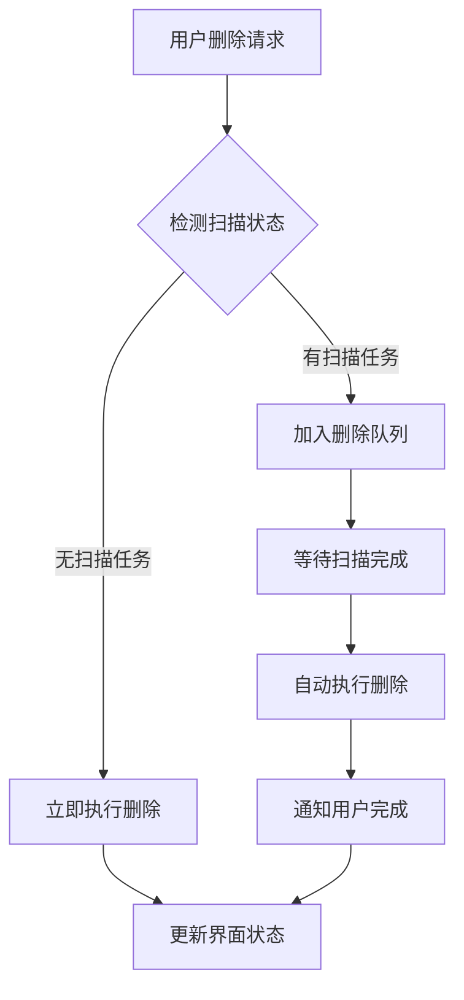

# 任务队列管理指南

bili-sync v2.7.2+ 引入了智能任务队列管理系统，自动协调扫描任务和删除操作，确保数据一致性和系统稳定性。本指南将详细介绍这一系统的工作原理和使用方法。

## 🗂️ 任务队列系统概述

### 背景与目标

在之前的版本中，如果用户在系统执行扫描任务时删除视频源，可能会导致：
- 数据库锁定冲突
- 数据不一致问题
- 程序异常崩溃
- 下载任务中断

任务队列系统通过智能调度机制完美解决了这些问题。

### 核心特性

- **🔄 智能冲突检测**：自动检测当前系统状态
- **📋 任务排队机制**：删除请求自动排队等待
- **👁️ 实时状态监控**：队列状态可视化显示
- **🛡️ 数据安全保障**：确保操作的原子性
- **⚡ 无感知体验**：用户操作无需等待

## 🚀 工作原理

### 系统状态检测

队列系统会持续监控以下状态：

1. **扫描任务状态**
   - 正在扫描的视频源数量
   - 扫描任务的进度
   - 预计完成时间

2. **数据库锁定状态**
   - 当前数据库事务状态
   - 锁定的表和记录
   - 并发访问情况

3. **资源使用情况**
   - CPU 和内存使用率
   - 网络连接状态
   - 磁盘 I/O 状况

### 智能调度逻辑



### 队列管理机制

1. **请求入队**
   ```typescript
   interface DeleteRequest {
     id: string;
     sourceType: 'favorite' | 'collection' | 'submission' | 'bangumi';
     sourceId: number;
     sourceName: string;
     deleteLocalFiles: boolean;
     timestamp: Date;
     priority: 'high' | 'normal' | 'low';
   }
   ```

2. **优先级处理**
   - **高优先级**：用户主动删除请求
   - **普通优先级**：系统维护删除
   - **低优先级**：批量清理操作

3. **执行时机**
   - 扫描任务完全结束
   - 数据库锁释放
   - 系统资源充足

## 📊 用户界面

### 队列状态显示

在管理界面中，您可以看到：

- **当前队列长度**：待处理删除请求数量
- **预计等待时间**：基于当前扫描进度的估算
- **详细状态信息**：每个请求的具体状态

### 实时通知

系统会通过以下方式提供反馈：

1. **即时提示**
   ```
   ✅ 删除请求已提交
   ⏳ 等待扫描完成后处理
   🔄 预计等待时间：2分钟
   ```

2. **进度更新**
   ```
   📊 当前队列：3个待处理请求
   ⚡ 正在处理：删除收藏夹"动漫收藏"
   ✅ 已完成：删除UP主"某某某"的投稿
   ```

3. **完成通知**
   ```
   ✅ 删除操作已完成
   📁 本地文件已清理：1.2GB
   📊 数据库记录已移除：156条
   ```

## 🎯 使用场景

### 场景1：扫描期间删除操作

**情况**：用户在系统扫描收藏夹时，尝试删除一个UP主投稿源

**系统响应**：
1. 检测到正在进行扫描任务
2. 删除请求进入队列等待
3. 显示等待状态和预计时间
4. 扫描完成后自动执行删除
5. 通知用户操作完成

### 场景2：批量删除操作

**情况**：用户快速删除多个视频源

**系统响应**：
1. 按顺序处理删除请求
2. 优化执行顺序减少冲突
3. 合并相似操作提高效率
4. 提供统一的进度反馈

### 场景3：系统维护期间

**情况**：系统执行数据库维护时的删除请求

**系统响应**：
1. 自动检测维护状态
2. 所有删除请求暂停排队
3. 维护完成后批量处理
4. 确保数据完整性

## ⚙️ 高级配置

### 队列参数调优

管理员可以通过配置文件调整队列行为：

```toml
[queue]
# 最大队列长度
max_queue_size = 100

# 检测间隔（秒）
check_interval = 5

# 超时时间（分钟）
timeout = 30

# 重试次数
max_retries = 3

# 批量处理大小
batch_size = 5
```

### 优先级策略

```toml
[queue.priority]
# 用户删除请求
user_delete = "high"

# 系统清理任务
system_cleanup = "normal"

# 定期维护
maintenance = "low"
```

### 通知设置

```toml
[queue.notifications]
# 启用桌面通知
desktop_enabled = true

# 启用邮件通知
email_enabled = false

# 启用Webhook通知
webhook_enabled = false
webhook_url = "https://your-webhook-url.com"
```

## 🔧 故障排除

### 常见问题

**Q: 队列一直显示等待状态？**
A: 检查是否有长时间运行的扫描任务。可以在日志中查看详细状态：
```bash
# 查看当前扫描状态
curl http://localhost:12345/api/status/scanning

# 查看队列状态
curl http://localhost:12345/api/queue/status
```

**Q: 删除操作失败了怎么办？**
A: 系统会自动重试失败的操作。如果持续失败，请检查：
- 磁盘空间是否充足
- 文件权限是否正确
- 网络连接是否稳定

**Q: 如何清空队列？**
A: 管理员可以通过API清空队列：
```bash
# 清空所有队列（谨慎使用）
curl -X DELETE http://localhost:12345/api/queue/clear

# 取消特定请求
curl -X DELETE http://localhost:12345/api/queue/{request_id}
```

### 日志分析

队列相关的日志信息：

```log
[INFO] 队列系统启动，开始监控扫描状态
[INFO] 删除请求已加入队列：收藏夹ID=12345
[INFO] 检测到扫描任务运行中，等待完成...
[INFO] 扫描任务完成，开始处理队列请求
[INFO] 正在执行删除操作：收藏夹"动漫收藏"
[INFO] 删除完成，清理本地文件：150MB
[WARN] 删除操作失败，将在30秒后重试
[ERROR] 队列请求超时，请检查系统状态
```

### 性能监控

监控队列系统性能的关键指标：

- **平均等待时间**：请求进入队列到执行的时间
- **处理成功率**：成功执行的操作比例
- **队列长度**：待处理请求的数量
- **系统响应时间**：从请求到完成的总时间

## 📈 性能优化

### 减少等待时间

1. **优化扫描频率**
   ```toml
   [scan]
   # 降低扫描频率减少冲突
   interval = "1h"  # 从30分钟调整为1小时
   ```

2. **并发控制**
   ```toml
   [download]
   # 减少并发下载数量
   max_concurrent = 3  # 从5减少到3
   ```

3. **智能调度**
   ```toml
   [queue]
   # 启用智能调度
   smart_scheduling = true
   
   # 预测扫描时间
   predict_scan_time = true
   ```

### 提升处理效率

1. **批量操作**
   - 相同类型的删除操作会自动合并
   - 减少数据库事务数量
   - 优化文件系统操作

2. **资源预留**
   - 为队列操作预留系统资源
   - 避免资源竞争导致的延迟
   - 智能负载均衡

3. **缓存优化**
   - 缓存常用的状态查询
   - 减少重复的数据库访问
   - 提升响应速度

## 🔮 未来规划

### 短期功能 (1-2周)

- **批量操作界面**：支持选择多个源批量删除
- **操作历史**：查看历史删除操作记录
- **估时优化**：更准确的等待时间预测

### 中期功能 (1个月)

- **智能调度**：基于历史数据的智能调度算法
- **分布式队列**：支持多实例部署的队列共享
- **高级通知**：邮件、短信、钉钉等通知方式

### 长期规划 (3个月)

- **AI优化**：机器学习优化调度策略
- **可视化仪表板**：详细的队列性能分析
- **企业功能**：工作流、审批、权限控制

## 💡 最佳实践

### 1. 合理规划删除时机

- **低峰期操作**：选择系统负载较低的时间删除
- **批量集中**：将多个删除操作集中在一起执行
- **避免冲突**：了解扫描计划，避开扫描时间

### 2. 监控系统状态

- **定期检查**：查看队列状态和系统性能
- **日志关注**：留意异常日志和错误信息
- **资源监控**：确保系统资源充足

### 3. 配置优化

- **根据需求调整**：基于实际使用情况调整参数
- **测试验证**：配置变更后进行充分测试
- **备份配置**：重要配置变更前进行备份

---

任务队列管理系统为bili-sync带来了更加稳定和可靠的操作体验。通过智能调度和冲突检测，确保了在任何情况下的数据安全和系统稳定性。