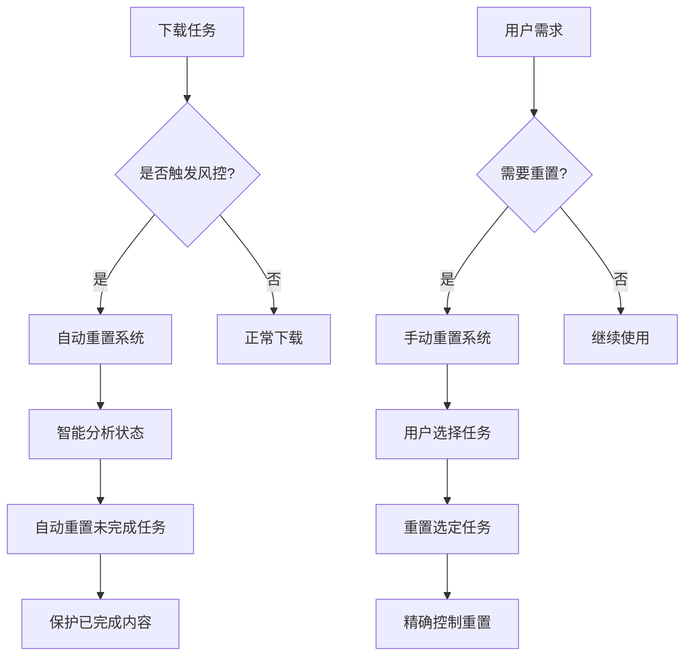
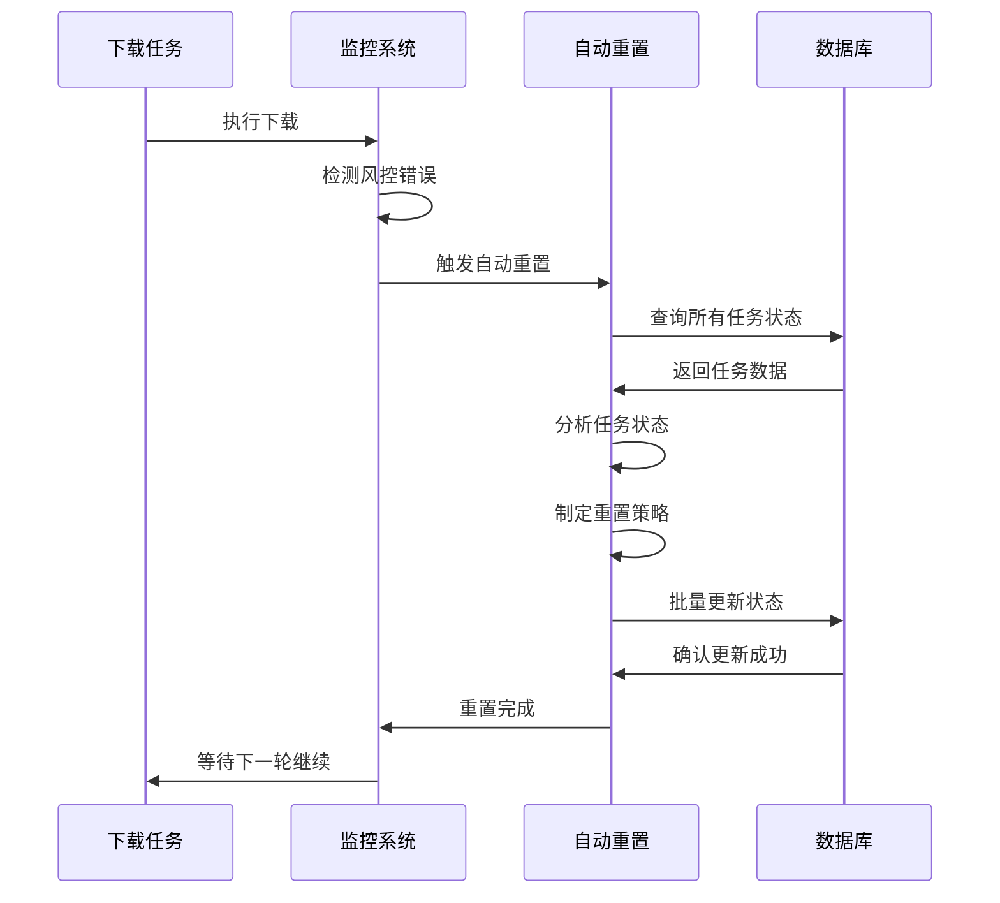

# 双重重置系统完整指南

bili-sync v2.7.2 引入了**双重重置系统**，将智能自动重置与强制手动重置完美结合，为用户提供了全方位的任务控制能力。这套系统既能自动处理常见问题，又能满足用户的精确控制需求。

## 🔄 系统概述

### 双重重置架构



### 两套系统的定位

| 特性 | 自动重置系统 | 手动重置系统 |
|------|-------------|-------------|
| **触发条件** | 检测到风控时自动触发 | 用户主动选择触发 |
| **重置范围** | 只重置未完成任务 | 可重置任何状态任务 |
| **用户干预** | 零干预，完全自动 | 用户精确控制 |
| **保护策略** | 智能保护已完成任务 | 用户决定是否保护 |
| **使用场景** | 风控恢复、异常处理 | 选择性重新下载、故障修复 |

## 🤖 自动重置系统

### 工作原理

自动重置系统是bili-sync的核心智能功能，专门用于处理风控和异常情况。

#### 触发条件
1. **风控检测**：API返回风控错误
2. **下载中止**：网络异常导致下载终止
3. **状态异常**：检测到异常的任务状态

#### 智能分析算法

```rust
pub async fn auto_reset_risk_control_failures(connection: &DatabaseConnection) -> Result<()> {
    info!("检测到风控，开始自动重置失败、进行中和未完成的下载任务...");
    
    // 查询所有任务数据
    let (all_videos, all_pages) = get_all_tasks(connection).await?;
    
    let mut resetted_videos = 0;
    let mut resetted_pages = 0;
    
    // 分析并重置视频任务
    for (id, name, download_status) in all_videos {
        let mut video_status = VideoStatus::from(download_status);
        let mut video_resetted = false;
        
        // 检查是否为完全成功状态（所有5个任务都是状态1）
        let is_fully_completed = (0..5).all(|task_index| video_status.get(task_index) == 1);
        
        if !is_fully_completed {
            // 重置策略：状态0（未开始）、状态2（进行中）、状态3（失败）
            for task_index in 0..5 {
                let status_value = video_status.get(task_index);
                if status_value == 3 || status_value == 2 || status_value == 0 {
                    video_status.set(task_index, 0); // 重置为未开始
                    video_resetted = true;
                }
                // 状态1（成功）保持不变
            }
        }
        
        if video_resetted {
            update_video_status(id, video_status.into(), connection).await?;
            resetted_videos += 1;
        }
    }
    
    info!("自动重置完成：重置了 {} 个视频和 {} 个页面", resetted_videos, resetted_pages);
    Ok(())
}
```

#### 状态保护策略

| 任务状态 | 数值 | 描述 | 重置策略 | 原因 |
|----------|------|------|----------|------|
| 未开始 | 0 | 任务尚未开始 | ✅ 重置 | 需要重新开始 |
| 成功完成 | 1 | 任务已成功完成 | ❌ 保护 | 避免重复下载 |
| 进行中/失败2次 | 2 | 任务正在进行或已失败2次 | ✅ 重置 | 可能受风控影响 |
| 失败3次 | 3 | 任务已失败3次 | ✅ 重置 | 重新尝试机会 |
| 最终成功 | 7 | 特殊成功状态 | ❌ 保护 | 确认完成状态 |

### 执行流程



### 日志示例

```
[INFO] 检测到风控，开始自动重置失败、进行中和未完成的下载任务...
[DEBUG] 重置视频「【技术分享】Rust编程实战」的未完成任务状态
[DEBUG] 重置视频「【教程】Docker容器化部署」的未完成任务状态
[DEBUG] 重置页面「第1页」的未完成任务状态
[INFO] 风控自动重置完成：重置了 15 个视频和 23 个页面的未完成任务状态
```

## 👤 手动重置系统

### 功能特性

手动重置系统为用户提供精确的任务控制能力，支持选择性重置和完全重置。

#### 重置类型对比

| 重置类型 | 传统重置 | 强制重置 |
|----------|----------|----------|
| **重置范围** | 只重置失败任务 | 可重置任何状态任务 |
| **成功任务** | 保持不变 | 可选择重置 |
| **使用场景** | 修复失败 | 重新下载、更新内容 |
| **风险程度** | 低风险 | 需谨慎使用 |

### 5种任务类型详解

每个视频包含5个独立的任务类型，用户可以精确控制：

#### 1. 视频封面 (Task Index 0)
- **内容**：视频缩略图、poster图像
- **文件格式**：JPG
- **重置场景**：封面模糊、尺寸错误、需要更新

#### 2. 视频内容 (Task Index 1)
- **内容**：主要视频文件
- **文件格式**：MP4
- **重置场景**：画质不满意、文件损坏、格式错误

#### 3. 视频信息 (Task Index 2)
- **内容**：视频元数据、NFO文件
- **文件格式**：NFO、XML
- **重置场景**：信息错误、缺少元数据、格式更新

#### 4. 视频弹幕 (Task Index 3)
- **内容**：弹幕文件
- **文件格式**：ASS
- **重置场景**：弹幕缺失、格式错误、需要重新转换

#### 5. 视频字幕 (Task Index 4)
- **内容**：字幕文件
- **文件格式**：SRT
- **重置场景**：字幕缺失、翻译更新、格式问题

### API接口

#### 传统重置接口
```http
POST /api/videos/reset
Content-Type: application/json

{
  "video_ids": [1, 2, 3]  // 可选，不指定则重置所有
}
```

#### 强制重置接口
```http
POST /api/videos/reset-specific-tasks
Content-Type: application/json

{
  "task_indexes": [0, 1, 2, 3, 4],  // 选择要重置的任务索引
  "video_ids": [1, 2, 3]            // 可选，不指定则应用于所有视频
}
```

### 前端界面设计

#### 重置选项界面

```typescript
interface ResetOptions {
  resetAll: boolean;           // 重置所有任务
  selectedTasks: number[];     // 选中的任务索引
  confirmReset: boolean;       // 确认重置
}

const taskOptions = [
  { index: 0, name: "视频封面", description: "缩略图和poster图像" },
  { index: 1, name: "视频内容", description: "主要视频文件" },
  { index: 2, name: "视频信息", description: "元数据和NFO文件" },
  { index: 3, name: "视频弹幕", description: "弹幕ASS文件" },
  { index: 4, name: "视频字幕", description: "字幕SRT文件" }
];
```

#### 交互逻辑

```typescript
// 互斥逻辑：选择"重置所有"时自动取消其他选项
const handleResetAllChange = (checked: boolean) => {
  if (checked) {
    setSelectedTasks([]);  // 清空其他选择
  }
  setResetAll(checked);
};

// 选择具体任务时自动取消"重置所有"
const handleTaskToggle = (taskIndex: number) => {
  setResetAll(false);
  setSelectedTasks(prev => 
    prev.includes(taskIndex) 
      ? prev.filter(i => i !== taskIndex)
      : [...prev, taskIndex]
  );
};
```

### 使用场景示例

#### 场景1：选择性重新下载字幕

**需求**：某个视频的字幕有更新，需要重新下载

**操作步骤**：
1. 进入视频详情页面
2. 点击"重置任务"按钮
3. 取消勾选"重置所有任务"
4. 勾选"视频字幕"选项
5. 点击"确认重置"

**结果**：
- ✅ 字幕任务状态重置为"未开始"
- ✅ 其他任务保持原状态
- ✅ 下次扫描时只重新下载字幕

#### 场景2：完全重新下载视频

**需求**：视频有重大更新，需要完全重新下载

**操作步骤**：
1. 进入视频详情页面
2. 点击"重置任务"按钮
3. 勾选"强制重置所有任务"
4. 确认重置警告信息
5. 点击"确认重置"

**结果**：
- ✅ 所有5个任务状态重置为"未开始"
- ✅ 已下载的文件在下次扫描时会被重新下载
- ✅ 获得最新版本的所有内容

#### 场景3：批量重置多个视频

**需求**：多个视频的封面需要重新下载

**操作步骤**：
1. 在视频列表页面选择多个视频
2. 点击"批量重置"按钮
3. 选择"视频封面"任务
4. 确认批量重置操作

**结果**：
- ✅ 所选视频的封面任务被重置
- ✅ 其他任务保持不变
- ✅ 批量操作提升效率

## 🛡️ 安全机制与警告

### 数据保护措施

#### 原子性操作
```rust
// 使用数据库事务确保操作原子性
let txn = connection.begin().await?;

// 批量重置操作
for update in reset_updates {
    entity.update(update).exec(&txn).await?;
}

// 原子提交或回滚
txn.commit().await?;
```

#### 确认机制

前端界面包含多重确认：

1. **操作确认**：用户必须明确选择重置任务
2. **风险警告**：显示重置可能的影响
3. **最终确认**：二次确认防止误操作

#### 警告信息示例

```typescript
const warnings = {
  resetAll: "⚠️ 重置所有任务将导致该视频完全重新下载，已下载的内容可能被覆盖",
  resetVideo: "⚠️ 重置视频内容将重新下载视频文件，可能耗费大量时间和流量",
  resetBatch: "⚠️ 批量重置将影响多个视频，请确认操作范围"
};
```

### 备份建议

在执行重置操作前建议：

1. **备份重要文件**：对重要视频文件进行备份
2. **记录当前状态**：截图或记录当前下载状态
3. **确认网络环境**：确保网络稳定，避免重置后下载失败

## 📊 监控与统计

### 重置统计信息

系统会记录详细的重置统计：

```typescript
interface ResetStatistics {
  totalVideos: number;        // 重置的视频总数
  totalPages: number;         // 重置的页面总数
  taskBreakdown: {           // 各任务类型重置数量
    cover: number;           // 封面任务
    video: number;           // 视频任务  
    info: number;            // 信息任务
    danmaku: number;         // 弹幕任务
    subtitle: number;        // 字幕任务
  };
  resetType: 'auto' | 'manual';  // 重置类型
  timestamp: string;         // 重置时间
  duration: number;          // 操作耗时
}
```

### 日志记录

```
[INFO] 用户手动重置：选择重置任务类型 [视频内容, 视频字幕]
[INFO] 强制重置完成：重置了 5 个视频的 2 种任务类型
[DEBUG] 重置视频「技术分享」的任务：视频内容, 视频字幕
[DEBUG] 重置视频「教程系列」的任务：视频内容, 视频字幕
```

## 🎯 最佳实践

### 使用建议

#### 1. 优先使用自动重置
- 自动重置能够处理大部分异常情况
- 无需用户干预，安全可靠
- 智能保护已完成内容

#### 2. 谨慎使用强制重置
- 仅在确实需要重新下载时使用
- 重置前确认当前状态和需求
- 考虑网络流量和时间成本

#### 3. 精确选择重置任务
- 根据实际需求选择特定任务类型
- 避免不必要的重新下载
- 优先重置小文件（封面、字幕）测试

#### 4. 批量操作策略
- 批量重置前仔细确认选择范围
- 优先在网络空闲时进行
- 监控重置后的下载进度

### 故障排除

#### 常见问题处理

**问题1：重置后任务没有重新开始**
- 检查视频源是否启用
- 确认扫描任务是否正常运行
- 查看系统日志确认重置是否成功

**问题2：部分任务重置失败**
- 检查数据库连接状态
- 确认是否有文件权限问题
- 查看错误日志定位具体原因

**问题3：重置后下载速度慢**
- 检查网络连接状态
- 确认是否触发了新的风控
- 调整并发设置和下载间隔

### 配置优化

```toml
# 推荐的重置相关配置
[download]
retry_times = 3          # 重试次数
timeout = 30             # 超时时间

[concurrent_limit]
video = 2                # 视频并发数
page = 3                 # 页面并发数

[advanced]
auto_reset_enabled = true    # 启用自动重置
reset_cooldown = 300         # 重置冷却时间（秒）
```

## 🔮 功能展望

### 未来增强

#### 1. 智能重置策略
- 基于历史数据的智能重置建议
- 自动识别最佳重置时机
- 个性化的重置策略配置

#### 2. 条件重置
- 基于文件大小的重置条件
- 基于时间的自动重置
- 基于质量检测的智能重置

#### 3. 重置预览
- 重置前预览影响范围
- 估算重新下载时间和流量
- 提供重置建议和优化方案

## 💡 常见问题

### Q: 自动重置和手动重置可以同时使用吗？
A: 可以。自动重置处理异常情况，手动重置处理用户需求，两者互不冲突。

### Q: 强制重置会删除已下载的文件吗？
A: 不会立即删除，但会在下次下载时覆盖原文件。建议重置前备份重要文件。

### Q: 为什么有些任务无法重置？
A: 可能是数据库锁定或任务正在执行中。等待当前任务完成后再尝试重置。

### Q: 重置操作可以撤销吗？
A: 重置操作不可撤销，但可以通过备份恢复文件。重置前请谨慎确认。

### Q: 批量重置有数量限制吗？
A: 没有硬性限制，但建议分批进行，避免对系统造成过大负载。

---

## 🎖️ 总结

双重重置系统是bili-sync v2.7.2的核心功能之一，它完美结合了智能自动化和用户精确控制：

**自动重置系统**：
- 🤖 智能检测和处理异常
- 🛡️ 100%保护已完成内容
- 🚀 零干预的无缝恢复

**手动重置系统**：
- 🎯 精确的任务控制
- 🔧 灵活的重置选项
- 👤 满足个性化需求

这套系统为用户提供了完整的任务管理解决方案，既能自动处理常见问题，又能满足特殊需求的精确控制，是bili-sync智能化程度的重要体现。