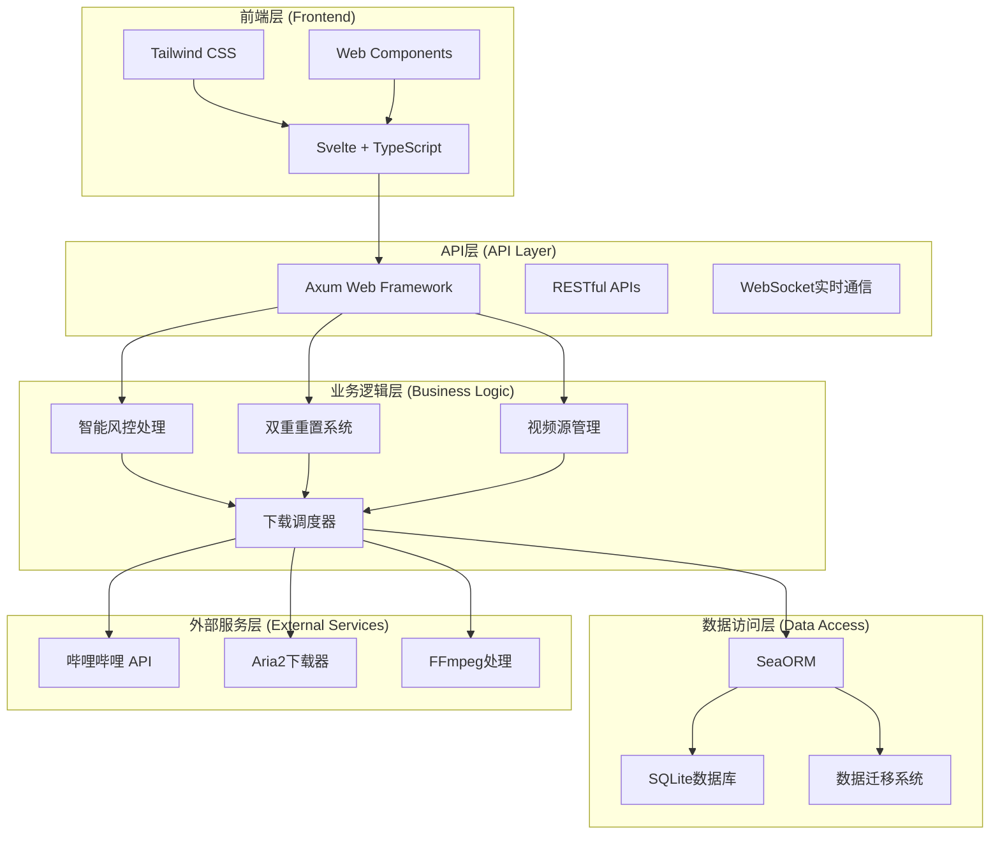
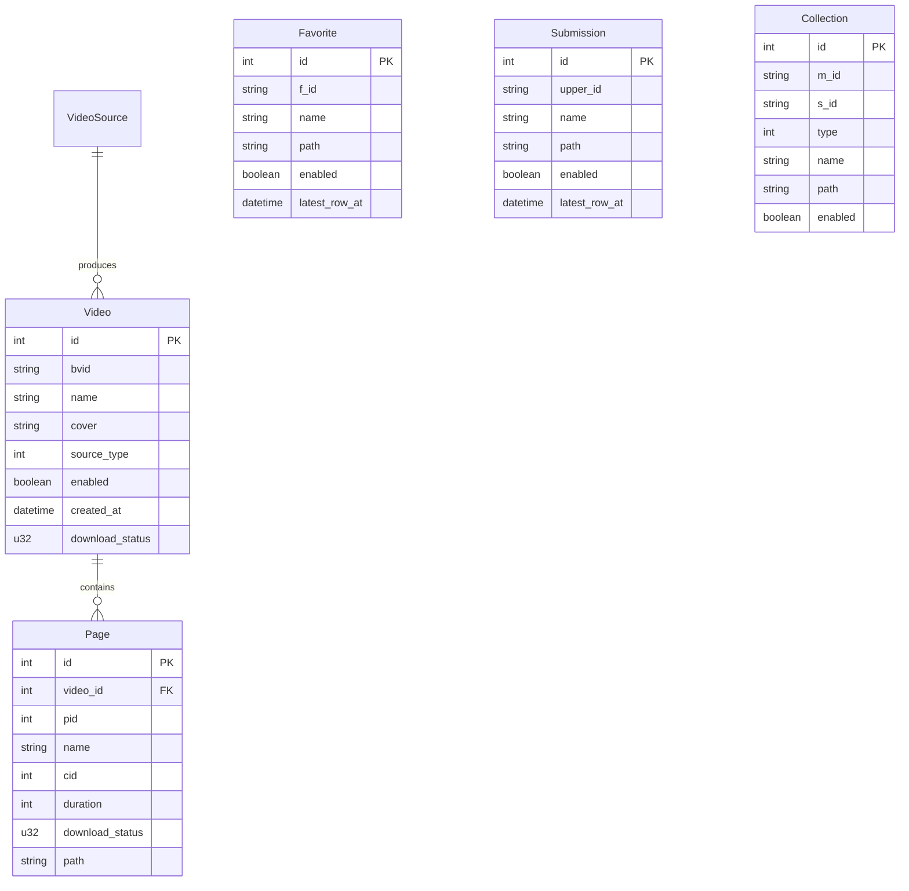

# 技术架构文档

bili-sync v2.7.2 Final 采用现代化的技术架构，实现了高性能、高可靠性和高可扩展性的设计目标。本文档详细介绍系统的技术架构、设计理念和核心实现。

## 🏗️ 整体架构

### 架构概览



### 技术栈

| 层级 | 技术选型 | 版本 | 用途 |
|------|----------|------|------|
| **前端框架** | Svelte | 4.x | 响应式用户界面 |
| **前端语言** | TypeScript | 5.x | 类型安全的前端开发 |
| **CSS框架** | Tailwind CSS | 3.x | 现代化样式设计 |
| **后端框架** | Axum | 0.7.x | 高性能Web服务 |
| **后端语言** | Rust | 1.75+ | 系统级性能与安全 |
| **异步运行时** | Tokio | 1.x | 异步并发处理 |
| **ORM框架** | SeaORM | 0.12.x | 数据库抽象层 |
| **数据库** | SQLite | 3.x | 轻量级数据存储 |
| **HTTP客户端** | Reqwest | 0.11.x | HTTP请求处理 |
| **下载器** | Aria2c | 1.x | 多线程下载支持 |
| **媒体处理** | FFmpeg | 6.x | 音视频处理 |

## 🎯 设计理念

### 1. 智能化优先
- **自动化处理**：最小化用户干预，系统自动处理复杂场景
- **智能决策**：基于算法的智能选择和优化
- **预测性维护**：主动发现和解决潜在问题

### 2. 高性能设计
- **异步并发**：Tokio运行时支持高并发操作
- **零拷贝优化**：最小化内存分配和数据复制
- **缓存策略**：多级缓存提升响应速度

### 3. 可靠性保障
- **错误恢复**：优雅的错误处理和自动恢复机制
- **数据一致性**：事务保证和状态管理
- **容错设计**：系统在异常情况下的稳定运行

### 4. 可扩展性
- **模块化设计**：清晰的模块边界和接口定义
- **插件架构**：支持功能扩展和定制
- **配置驱动**：灵活的配置系统

## 🧠 核心子系统

### 智能风控处理系统

#### 架构设计
```rust
// 风控检测与处理架构
pub struct RiskControlProcessor {
    detector: Arc<RiskControlDetector>,
    handler: Arc<RiskControlHandler>,
    recovery: Arc<AutoRecoverySystem>,
}

impl RiskControlProcessor {
    // 多层检测机制
    pub async fn detect_risk_control(&self, error: &anyhow::Error) -> bool {
        // API层检测
        if self.detector.check_api_error(error) { return true; }
        
        // 网络层检测
        if self.detector.check_network_error(error) { return true; }
        
        // 业务层检测
        if self.detector.check_business_error(error) { return true; }
        
        false
    }
    
    // 智能处理流程
    pub async fn handle_risk_control(&self, connection: &DatabaseConnection) -> Result<()> {
        // 1. 停止当前所有任务
        self.handler.abort_all_tasks().await?;
        
        // 2. 智能状态分析
        let analysis = self.handler.analyze_task_states(connection).await?;
        
        // 3. 精确重置策略
        self.handler.apply_reset_strategy(analysis, connection).await?;
        
        // 4. 准备自动恢复
        self.recovery.prepare_recovery().await?;
        
        Ok(())
    }
}
```

#### 状态管理算法
```rust
// 智能状态保护算法
pub fn intelligent_reset_strategy(tasks: &[TaskState]) -> ResetPlan {
    let mut plan = ResetPlan::new();
    
    for task in tasks {
        match task.status {
            TaskStatus::Completed(1) => {
                // 成功完成的任务，保护不重置
                plan.protect(task.id);
            },
            TaskStatus::InProgress(2) | TaskStatus::Failed(3) | TaskStatus::NotStarted(0) => {
                // 未完成的任务，重置为初始状态
                plan.reset(task.id, TaskStatus::NotStarted(0));
            },
            _ => {
                // 其他状态按具体情况处理
                plan.analyze(task);
            }
        }
    }
    
    plan
}
```

### 双重重置系统

#### 系统架构
```rust
// 双重重置系统设计
pub struct DualResetSystem {
    auto_reset: AutoResetProcessor,
    manual_reset: ManualResetProcessor,
    state_manager: StateManager,
}

// 自动重置处理器
pub struct AutoResetProcessor {
    trigger_conditions: Vec<ResetTrigger>,
    reset_strategy: ResetStrategy,
}

// 手动重置处理器  
pub struct ManualResetProcessor {
    task_selector: TaskSelector,
    reset_validator: ResetValidator,
    confirmation_system: ConfirmationSystem,
}

impl DualResetSystem {
    // 风控触发的自动重置
    pub async fn auto_reset_on_risk_control(&self, connection: &DatabaseConnection) -> Result<ResetResult> {
        let analysis = self.state_manager.analyze_all_tasks(connection).await?;
        let strategy = self.auto_reset.generate_strategy(analysis);
        self.auto_reset.execute_reset(strategy, connection).await
    }
    
    // 用户主导的手动重置
    pub async fn manual_reset(&self, request: ManualResetRequest, connection: &DatabaseConnection) -> Result<ResetResult> {
        // 验证重置请求
        self.manual_reset.reset_validator.validate(&request)?;
        
        // 确认操作安全性
        let confirmation = self.manual_reset.confirmation_system.confirm(&request).await?;
        
        // 执行精确重置
        self.manual_reset.execute_precise_reset(request, connection).await
    }
}
```

#### 任务状态机
```rust
// 任务状态转换机制
#[derive(Debug, Clone, Copy)]
pub enum TaskStatus {
    NotStarted = 0,     // 未开始
    Completed = 1,      // 成功完成
    InProgress = 2,     // 进行中/失败2次
    Failed = 3,         // 失败3次
    FinalSuccess = 7,   // 最终成功状态
}

impl TaskStatus {
    // 状态转换规则
    pub fn can_reset(&self) -> bool {
        match self {
            TaskStatus::Completed | TaskStatus::FinalSuccess => false, // 保护已完成
            _ => true, // 其他状态可以重置
        }
    }
    
    // 智能重置目标
    pub fn reset_target(&self) -> TaskStatus {
        TaskStatus::NotStarted
    }
}
```

### 视频源管理系统

#### 统一抽象接口
```rust
// 视频源统一抽象
#[async_trait]
pub trait VideoSource {
    type Item: VideoItem;
    
    async fn fetch_videos(&self, page: u32) -> Result<Vec<Self::Item>>;
    async fn get_latest_update_time(&self) -> Result<DateTime<Utc>>;
    async fn validate_source(&self) -> Result<bool>;
    
    // 启用/禁用状态管理
    fn is_enabled(&self) -> bool;
    async fn set_enabled(&mut self, enabled: bool) -> Result<()>;
}

// 具体实现
pub struct FavoriteSource {
    fid: String,
    enabled: bool,
    last_update: Option<DateTime<Utc>>,
}

pub struct SubmissionSource {
    upper_id: String,
    enabled: bool,
    last_update: Option<DateTime<Utc>>,
}

pub struct BangumiSource {
    season_id: String,
    download_all_seasons: bool,
    selected_seasons: Option<Vec<String>>,
    enabled: bool,
}
```

#### 动态调度器
```rust
// 智能视频源调度
pub struct VideoSourceScheduler {
    sources: Arc<RwLock<Vec<Box<dyn VideoSource + Send + Sync>>>>,
    scheduler: Arc<TaskScheduler>,
}

impl VideoSourceScheduler {
    // 只处理启用的视频源
    pub async fn scan_enabled_sources(&self) -> Result<ScanResult> {
        let sources = self.sources.read().await;
        let enabled_sources: Vec<_> = sources
            .iter()
            .filter(|source| source.is_enabled())
            .collect();
            
        info!("开始扫描 {} 个启用的视频源", enabled_sources.len());
        
        let mut results = Vec::new();
        for source in enabled_sources {
            if let Ok(result) = self.scan_single_source(source).await {
                results.push(result);
            }
        }
        
        Ok(ScanResult::new(results))
    }
}
```

### 下载调度系统

#### 多级调度架构
```rust
// 分层下载调度
pub struct DownloadScheduler {
    video_scheduler: VideoScheduler,
    page_scheduler: PageScheduler,
    resource_manager: ResourceManager,
    concurrency_limiter: ConcurrencyLimiter,
}

// 并发控制
pub struct ConcurrencyLimiter {
    video_semaphore: Arc<Semaphore>,
    page_semaphore: Arc<Semaphore>,
    network_semaphore: Arc<Semaphore>,
}

impl DownloadScheduler {
    // 智能资源分配
    pub async fn schedule_downloads(&self, videos: Vec<VideoTask>) -> Result<()> {
        let video_semaphore = &self.concurrency_limiter.video_semaphore;
        
        let tasks = videos.into_iter().map(|video| {
            let semaphore = video_semaphore.clone();
            let scheduler = self.clone();
            
            async move {
                let _permit = semaphore.acquire().await?;
                scheduler.process_video(video).await
            }
        });
        
        // 并发执行，智能错误处理
        futures::future::try_join_all(tasks).await?;
        Ok(())
    }
    
    // 自适应重试机制
    pub async fn adaptive_retry<F, T>(&self, operation: F, max_retries: u32) -> Result<T>
    where
        F: Fn() -> Pin<Box<dyn Future<Output = Result<T>> + Send>> + Send + Sync,
    {
        let mut attempts = 0;
        loop {
            match operation().await {
                Ok(result) => return Ok(result),
                Err(e) if attempts < max_retries => {
                    let delay = self.calculate_backoff_delay(attempts);
                    tokio::time::sleep(delay).await;
                    attempts += 1;
                }
                Err(e) => return Err(e),
            }
        }
    }
}
```

## 🗄️ 数据架构

### 数据库设计

#### 核心实体关系


#### 性能优化索引
```sql
-- 关键查询索引
CREATE INDEX idx_video_source_enabled ON video(source_type, enabled);
CREATE INDEX idx_video_download_status ON video(download_status);
CREATE INDEX idx_page_video_status ON page(video_id, download_status);
CREATE INDEX idx_favorite_enabled ON favorite(enabled);
CREATE INDEX idx_submission_enabled ON submission(enabled);
CREATE INDEX idx_collection_enabled ON collection(enabled);

-- 复合索引优化
CREATE INDEX idx_video_source_time ON video(source_type, enabled, created_at);
CREATE INDEX idx_page_video_download ON page(video_id, download_status, pid);
```

### 数据迁移系统

#### 版本化迁移
```rust
// 数据库迁移管理
pub struct MigrationManager {
    migrations: Vec<Box<dyn Migration>>,
    current_version: u32,
}

#[async_trait]
pub trait Migration {
    fn version(&self) -> u32;
    fn description(&self) -> &str;
    async fn up(&self, connection: &DatabaseConnection) -> Result<()>;
    async fn down(&self, connection: &DatabaseConnection) -> Result<()>;
}

// v2.7.2 Final 新增迁移
pub struct AddEnabledFieldMigration;

#[async_trait]
impl Migration for AddEnabledFieldMigration {
    fn version(&self) -> u32 { 20250613_000002 }
    
    fn description(&self) -> &str {
        "Add enabled field to all video source tables"
    }
    
    async fn up(&self, connection: &DatabaseConnection) -> Result<()> {
        // 为所有视频源表添加enabled字段
        let sqls = vec![
            "ALTER TABLE favorite ADD COLUMN enabled BOOLEAN DEFAULT true",
            "ALTER TABLE submission ADD COLUMN enabled BOOLEAN DEFAULT true", 
            "ALTER TABLE collection ADD COLUMN enabled BOOLEAN DEFAULT true",
            "ALTER TABLE watch_later ADD COLUMN enabled BOOLEAN DEFAULT true",
            "ALTER TABLE video_source ADD COLUMN enabled BOOLEAN DEFAULT true",
        ];
        
        for sql in sqls {
            connection.execute_unprepared(sql).await?;
        }
        
        Ok(())
    }
}
```

## 🌐 网络架构

### HTTP服务设计

#### Axum路由架构
```rust
// RESTful API 路由设计
pub fn create_app() -> Router {
    Router::new()
        // 视频源管理
        .nest("/api/sources", source_routes())
        // 视频管理
        .nest("/api/videos", video_routes())
        // 重置系统
        .nest("/api/reset", reset_routes())
        // 系统管理
        .nest("/api/system", system_routes())
        // 图片代理
        .route("/api/proxy/image", get(proxy_image))
        // WebSocket实时通信
        .route("/ws", get(websocket_handler))
        // 静态文件服务
        .nest_service("/", ServeDir::new("./web/dist"))
        // 中间件
        .layer(cors_layer())
        .layer(auth_layer())
        .layer(logging_layer())
}

// 分模块路由
fn video_routes() -> Router {
    Router::new()
        .route("/", get(list_videos).post(create_video))
        .route("/:id", get(get_video).put(update_video).delete(delete_video))
        .route("/reset", post(reset_videos))
        .route("/reset-specific-tasks", post(reset_specific_tasks))
        .route("/:id/pages", get(list_pages))
}
```

#### 中间件系统
```rust
// 认证中间件
pub async fn auth_middleware(
    req: Request<Body>,
    next: Next<Body>,
) -> Result<Response, StatusCode> {
    let auth_header = req.headers().get("Authorization");
    
    if let Some(token) = auth_header.and_then(|h| h.to_str().ok()) {
        if validate_token(token).await? {
            return Ok(next.run(req).await);
        }
    }
    
    Err(StatusCode::UNAUTHORIZED)
}

// 错误处理中间件
pub async fn error_handling_middleware(
    req: Request<Body>,
    next: Next<Body>,
) -> Response {
    match next.run(req).await {
        response => {
            if response.status().is_server_error() {
                // 记录错误日志
                error!("Server error: {:?}", response);
                
                // 返回标准化错误响应
                create_error_response(response.status(), "Internal server error")
            } else {
                response
            }
        }
    }
}
```

### WebSocket实时通信

#### 实时事件系统
```rust
// WebSocket事件系统
pub struct WebSocketManager {
    connections: Arc<RwLock<HashMap<Uuid, WebSocketConnection>>>,
    event_bus: Arc<EventBus>,
}

#[derive(Debug, Clone, Serialize)]
pub enum SystemEvent {
    DownloadProgress { video_id: i32, progress: f64 },
    VideoAdded { video: VideoModel },
    VideoDeleted { video_id: i32 },
    RiskControlDetected { message: String },
    ResetCompleted { reset_type: ResetType, count: u32 },
    SourceStatusChanged { source_id: i32, enabled: bool },
}

impl WebSocketManager {
    // 广播系统事件
    pub async fn broadcast_event(&self, event: SystemEvent) {
        let connections = self.connections.read().await;
        let message = serde_json::to_string(&event).unwrap();
        
        for connection in connections.values() {
            if let Err(e) = connection.send(message.clone()).await {
                warn!("Failed to send WebSocket message: {}", e);
            }
        }
    }
    
    // 处理客户端连接
    pub async fn handle_connection(&self, socket: WebSocket) {
        let (sender, mut receiver) = socket.split();
        let connection_id = Uuid::new_v4();
        
        // 注册连接
        {
            let mut connections = self.connections.write().await;
            connections.insert(connection_id, WebSocketConnection::new(sender));
        }
        
        // 处理消息
        while let Some(msg) = receiver.next().await {
            match msg {
                Ok(Message::Text(text)) => {
                    if let Ok(command) = serde_json::from_str::<ClientCommand>(&text) {
                        self.handle_client_command(command).await;
                    }
                }
                Ok(Message::Close(_)) => break,
                Err(e) => {
                    error!("WebSocket error: {}", e);
                    break;
                }
                _ => {}
            }
        }
        
        // 清理连接
        {
            let mut connections = self.connections.write().await;
            connections.remove(&connection_id);
        }
    }
}
```

## 🔒 安全架构

### 认证与授权

#### Token认证系统
```rust
// JWT Token管理
pub struct TokenManager {
    secret_key: Vec<u8>,
    token_duration: Duration,
}

impl TokenManager {
    // 生成访问令牌
    pub fn generate_token(&self, user_id: &str) -> Result<String> {
        let claims = Claims {
            sub: user_id.to_string(),
            exp: (Utc::now() + self.token_duration).timestamp() as usize,
            iat: Utc::now().timestamp() as usize,
        };
        
        encode(&Header::default(), &claims, &EncodingKey::from_secret(&self.secret_key))
            .map_err(|e| anyhow!("Token generation failed: {}", e))
    }
    
    // 验证令牌
    pub fn validate_token(&self, token: &str) -> Result<Claims> {
        decode::<Claims>(
            token,
            &DecodingKey::from_secret(&self.secret_key),
            &Validation::default(),
        )
        .map(|token_data| token_data.claims)
        .map_err(|e| anyhow!("Token validation failed: {}", e))
    }
}
```

#### 权限控制
```rust
// 基于角色的访问控制
#[derive(Debug, Clone)]
pub enum Permission {
    ReadVideos,
    WriteVideos,
    DeleteVideos,
    ManageSources,
    SystemConfig,
    ResetTasks,
}

#[derive(Debug, Clone)]
pub enum Role {
    Viewer,
    Editor,
    Admin,
}

impl Role {
    pub fn permissions(&self) -> Vec<Permission> {
        match self {
            Role::Viewer => vec![Permission::ReadVideos],
            Role::Editor => vec![
                Permission::ReadVideos,
                Permission::WriteVideos,
                Permission::ManageSources,
            ],
            Role::Admin => vec![
                Permission::ReadVideos,
                Permission::WriteVideos,
                Permission::DeleteVideos,
                Permission::ManageSources,
                Permission::SystemConfig,
                Permission::ResetTasks,
            ],
        }
    }
}
```

### 数据安全

#### 敏感数据保护
```rust
// 敏感配置加密
pub struct SecretManager {
    encryption_key: [u8; 32],
}

impl SecretManager {
    // 加密敏感配置
    pub fn encrypt_config(&self, config: &str) -> Result<String> {
        let cipher = ChaCha20Poly1305::new(GenericArray::from_slice(&self.encryption_key));
        let nonce = ChaCha20Poly1305::generate_nonce(&mut OsRng);
        
        let ciphertext = cipher
            .encrypt(&nonce, config.as_bytes())
            .map_err(|e| anyhow!("Encryption failed: {}", e))?;
        
        let mut result = nonce.to_vec();
        result.extend(ciphertext);
        
        Ok(base64::encode(result))
    }
    
    // 解密敏感配置
    pub fn decrypt_config(&self, encrypted: &str) -> Result<String> {
        let data = base64::decode(encrypted)?;
        let (nonce_bytes, ciphertext) = data.split_at(12);
        
        let cipher = ChaCha20Poly1305::new(GenericArray::from_slice(&self.encryption_key));
        let nonce = GenericArray::from_slice(nonce_bytes);
        
        let plaintext = cipher
            .decrypt(nonce, ciphertext)
            .map_err(|e| anyhow!("Decryption failed: {}", e))?;
        
        String::from_utf8(plaintext).map_err(|e| anyhow!("Invalid UTF-8: {}", e))
    }
}
```

## ⚡ 性能优化

### 异步并发优化

#### 智能并发控制
```rust
// 自适应并发控制
pub struct AdaptiveConcurrencyLimiter {
    video_limit: Arc<AtomicUsize>,
    page_limit: Arc<AtomicUsize>,
    success_rate: Arc<AtomicU64>,
    adjustment_interval: Duration,
}

impl AdaptiveConcurrencyLimiter {
    // 动态调整并发数
    pub async fn adjust_concurrency(&self) {
        let current_success_rate = self.get_success_rate();
        
        match current_success_rate {
            rate if rate > 0.95 => {
                // 成功率高，可以提升并发
                self.increase_concurrency().await;
            }
            rate if rate < 0.80 => {
                // 成功率低，降低并发
                self.decrease_concurrency().await;
            }
            _ => {
                // 成功率适中，保持当前设置
            }
        }
    }
    
    // 获取当前最佳并发数
    pub async fn acquire_video_permit(&self) -> Result<SemaphorePermit> {
        let current_limit = self.video_limit.load(Ordering::Relaxed);
        let semaphore = Semaphore::new(current_limit);
        semaphore.acquire().await.map_err(|e| anyhow!("Failed to acquire permit: {}", e))
    }
}
```

### 内存优化

#### 零拷贝数据处理
```rust
// 零拷贝文件处理
pub struct ZeroCopyFileHandler;

impl ZeroCopyFileHandler {
    // 使用内存映射进行大文件处理
    pub async fn process_large_file<F>(path: &Path, processor: F) -> Result<()>
    where
        F: Fn(&[u8]) -> Result<()>,
    {
        let file = File::open(path).await?;
        let mmap = unsafe { MmapOptions::new().map(&file)? };
        
        // 分块处理，避免大量内存分配
        const CHUNK_SIZE: usize = 64 * 1024; // 64KB chunks
        
        for chunk in mmap.chunks(CHUNK_SIZE) {
            processor(chunk)?;
        }
        
        Ok(())
    }
    
    // 流式数据传输
    pub async fn stream_download(url: &str, path: &Path) -> Result<()> {
        let response = reqwest::get(url).await?;
        let mut file = File::create(path).await?;
        let mut stream = response.bytes_stream();
        
        while let Some(chunk) = stream.next().await {
            let chunk = chunk?;
            file.write_all(&chunk).await?;
        }
        
        file.flush().await?;
        Ok(())
    }
}
```

### 缓存系统

#### 多级缓存架构
```rust
// 多级缓存系统
pub struct MultiLevelCache {
    l1_cache: Arc<RwLock<LruCache<String, Arc<CacheEntry>>>>, // 内存缓存
    l2_cache: Arc<DiskCache>,                                  // 磁盘缓存
    l3_cache: Arc<DatabaseCache>,                             // 数据库缓存
}

impl MultiLevelCache {
    // 智能缓存获取
    pub async fn get<T: DeserializeOwned>(&self, key: &str) -> Option<T> {
        // L1: 内存缓存
        if let Some(entry) = self.l1_cache.read().await.get(key) {
            if !entry.is_expired() {
                return entry.value::<T>().ok();
            }
        }
        
        // L2: 磁盘缓存
        if let Ok(Some(value)) = self.l2_cache.get(key).await {
            // 回填L1缓存
            self.l1_cache.write().await.put(key.to_string(), Arc::new(CacheEntry::new(value.clone())));
            return Some(value);
        }
        
        // L3: 数据库缓存
        if let Ok(Some(value)) = self.l3_cache.get(key).await {
            // 回填上级缓存
            self.l2_cache.put(key, &value).await.ok();
            self.l1_cache.write().await.put(key.to_string(), Arc::new(CacheEntry::new(value.clone())));
            return Some(value);
        }
        
        None
    }
    
    // 智能缓存更新
    pub async fn put<T: Serialize>(&self, key: &str, value: T, ttl: Duration) -> Result<()> {
        let entry = Arc::new(CacheEntry::with_ttl(value, ttl));
        
        // 同时更新所有缓存层
        self.l1_cache.write().await.put(key.to_string(), entry.clone());
        self.l2_cache.put(key, &entry.value).await?;
        self.l3_cache.put(key, &entry.value).await?;
        
        Ok(())
    }
}
```

## 📊 监控与可观测性

### 指标收集系统

#### 性能指标监控
```rust
// 系统指标收集
pub struct MetricsCollector {
    download_metrics: Arc<DownloadMetrics>,
    system_metrics: Arc<SystemMetrics>,
    business_metrics: Arc<BusinessMetrics>,
}

#[derive(Debug, Clone)]
pub struct DownloadMetrics {
    pub total_downloads: AtomicU64,
    pub successful_downloads: AtomicU64,
    pub failed_downloads: AtomicU64,
    pub average_speed: AtomicU64, // bytes per second
    pub current_active_downloads: AtomicUsize,
}

impl MetricsCollector {
    // 记录下载事件
    pub fn record_download_event(&self, event: DownloadEvent) {
        match event {
            DownloadEvent::Started { .. } => {
                self.download_metrics.current_active_downloads.fetch_add(1, Ordering::Relaxed);
            }
            DownloadEvent::Completed { size, duration } => {
                self.download_metrics.successful_downloads.fetch_add(1, Ordering::Relaxed);
                self.download_metrics.current_active_downloads.fetch_sub(1, Ordering::Relaxed);
                
                let speed = size as f64 / duration.as_secs_f64();
                self.update_average_speed(speed as u64);
            }
            DownloadEvent::Failed { .. } => {
                self.download_metrics.failed_downloads.fetch_add(1, Ordering::Relaxed);
                self.download_metrics.current_active_downloads.fetch_sub(1, Ordering::Relaxed);
            }
        }
    }
    
    // 生成指标报告
    pub fn generate_metrics_report(&self) -> MetricsReport {
        MetricsReport {
            download_success_rate: self.calculate_success_rate(),
            average_download_speed: self.download_metrics.average_speed.load(Ordering::Relaxed),
            active_downloads: self.download_metrics.current_active_downloads.load(Ordering::Relaxed),
            system_load: self.system_metrics.get_current_load(),
            memory_usage: self.system_metrics.get_memory_usage(),
            disk_usage: self.system_metrics.get_disk_usage(),
        }
    }
}
```

### 日志系统

#### 结构化日志
```rust
// 结构化日志系统
pub struct StructuredLogger {
    inner: Arc<dyn Logger>,
    context: Arc<RwLock<LogContext>>,
}

#[derive(Debug, Clone, Serialize)]
pub struct LogEntry {
    pub timestamp: DateTime<Utc>,
    pub level: LogLevel,
    pub module: String,
    pub message: String,
    pub fields: HashMap<String, serde_json::Value>,
    pub trace_id: Option<String>,
}

impl StructuredLogger {
    // 记录业务事件
    pub async fn log_business_event(&self, event: BusinessEvent) {
        let entry = LogEntry {
            timestamp: Utc::now(),
            level: LogLevel::Info,
            module: "business".to_string(),
            message: event.description(),
            fields: event.to_fields(),
            trace_id: self.get_current_trace_id().await,
        };
        
        self.inner.log(entry).await;
    }
    
    // 记录性能事件
    pub async fn log_performance_event(&self, operation: &str, duration: Duration, success: bool) {
        let mut fields = HashMap::new();
        fields.insert("operation".to_string(), json!(operation));
        fields.insert("duration_ms".to_string(), json!(duration.as_millis()));
        fields.insert("success".to_string(), json!(success));
        
        let entry = LogEntry {
            timestamp: Utc::now(),
            level: if success { LogLevel::Info } else { LogLevel::Warn },
            module: "performance".to_string(),
            message: format!("Operation {} completed in {}ms", operation, duration.as_millis()),
            fields,
            trace_id: self.get_current_trace_id().await,
        };
        
        self.inner.log(entry).await;
    }
}
```

## 🔮 扩展性设计

### 插件系统架构

#### 插件接口定义
```rust
// 插件系统接口
#[async_trait]
pub trait Plugin: Send + Sync {
    fn name(&self) -> &str;
    fn version(&self) -> &str;
    
    async fn initialize(&mut self, context: PluginContext) -> Result<()>;
    async fn shutdown(&mut self) -> Result<()>;
    
    // 生命周期钩子
    async fn on_video_added(&self, video: &VideoModel) -> Result<()> { Ok(()) }
    async fn on_video_downloaded(&self, video: &VideoModel) -> Result<()> { Ok(()) }
    async fn on_download_failed(&self, video: &VideoModel, error: &anyhow::Error) -> Result<()> { Ok(()) }
    
    // 自定义处理器
    async fn process_custom_event(&self, event: CustomEvent) -> Result<Option<CustomResponse>> { 
        Ok(None) 
    }
}

// 插件管理器
pub struct PluginManager {
    plugins: Arc<RwLock<HashMap<String, Box<dyn Plugin>>>>,
    event_bus: Arc<EventBus>,
}

impl PluginManager {
    // 注册插件
    pub async fn register_plugin(&self, plugin: Box<dyn Plugin>) -> Result<()> {
        let name = plugin.name().to_string();
        
        // 初始化插件
        let mut plugin = plugin;
        plugin.initialize(self.create_plugin_context()).await?;
        
        // 注册事件监听
        self.register_plugin_events(&name).await?;
        
        // 存储插件
        self.plugins.write().await.insert(name.clone(), plugin);
        
        info!("Plugin '{}' registered successfully", name);
        Ok(())
    }
    
    // 触发插件事件
    pub async fn trigger_event(&self, event: PluginEvent) -> Result<()> {
        let plugins = self.plugins.read().await;
        
        for plugin in plugins.values() {
            match &event {
                PluginEvent::VideoAdded(video) => {
                    if let Err(e) = plugin.on_video_added(video).await {
                        warn!("Plugin '{}' failed to handle video_added event: {}", plugin.name(), e);
                    }
                }
                PluginEvent::VideoDownloaded(video) => {
                    if let Err(e) = plugin.on_video_downloaded(video).await {
                        warn!("Plugin '{}' failed to handle video_downloaded event: {}", plugin.name(), e);
                    }
                }
                PluginEvent::DownloadFailed(video, error) => {
                    if let Err(e) = plugin.on_download_failed(video, error).await {
                        warn!("Plugin '{}' failed to handle download_failed event: {}", plugin.name(), e);
                    }
                }
            }
        }
        
        Ok(())
    }
}
```

## 📋 总结

bili-sync v2.7.2 Final 的技术架构代表了现代化系统设计的最佳实践：

### 🎯 架构优势

**🤖 智能化设计**：
- 自动风控处理和恢复机制
- 智能并发控制和资源分配
- 自适应性能优化算法

**⚡ 高性能架构**：
- Rust + Tokio 异步并发基础
- 零拷贝和内存映射优化
- 多级缓存和智能预取

**🛡️ 可靠性保障**：
- 事务性状态管理
- 优雅降级和错误恢复
- 分布式系统设计理念

**🔧 可扩展性**：
- 模块化和插件化架构
- 标准化接口和协议
- 配置驱动的灵活性

### 🚀 技术创新

1. **智能风控处理系统** - 业界首创的零干预风控处理
2. **双重重置架构** - 自动化与精确控制的完美结合
3. **动态并发调度** - 基于性能反馈的自适应并发控制
4. **多级缓存系统** - 内存、磁盘、数据库的三级缓存架构

这套架构不仅解决了当前的技术挑战，更为未来的功能扩展和性能优化奠定了坚实的基础，代表了 bili-sync 从工具向平台演进的重要里程碑。