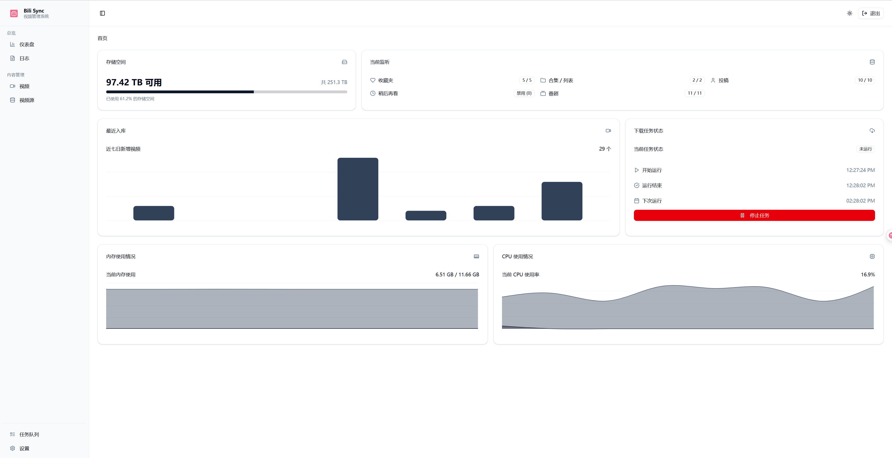
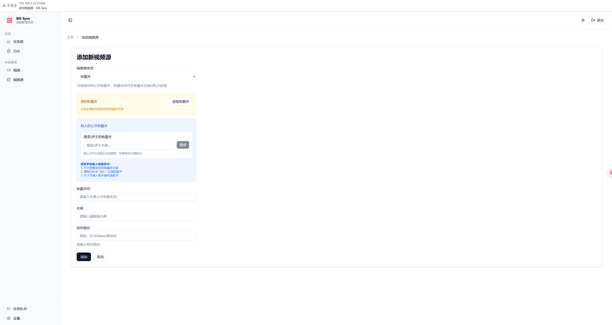
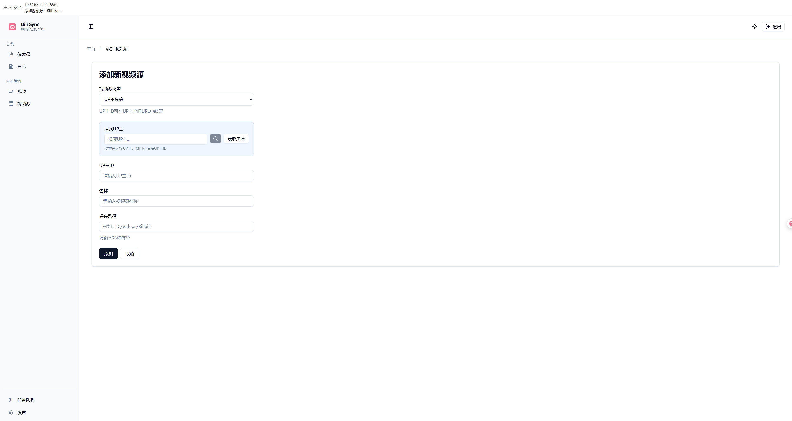
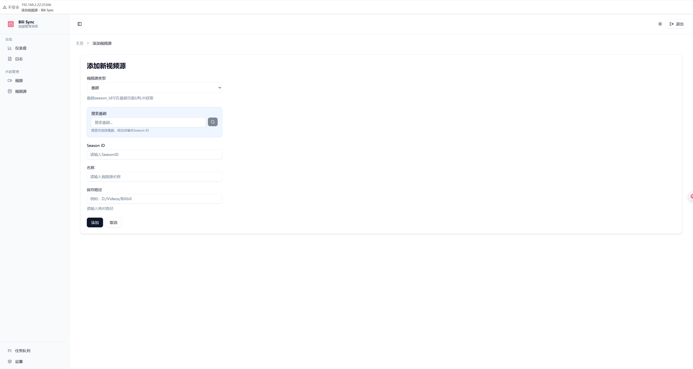
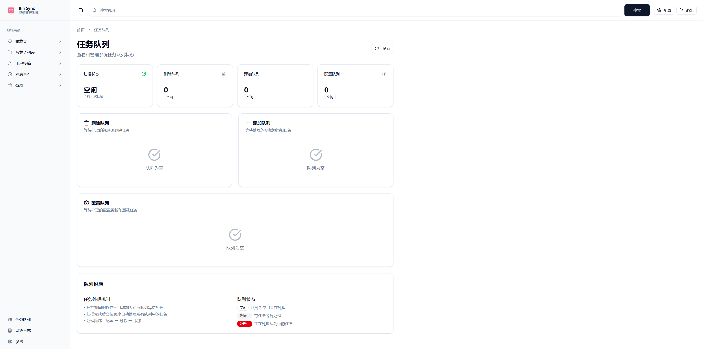
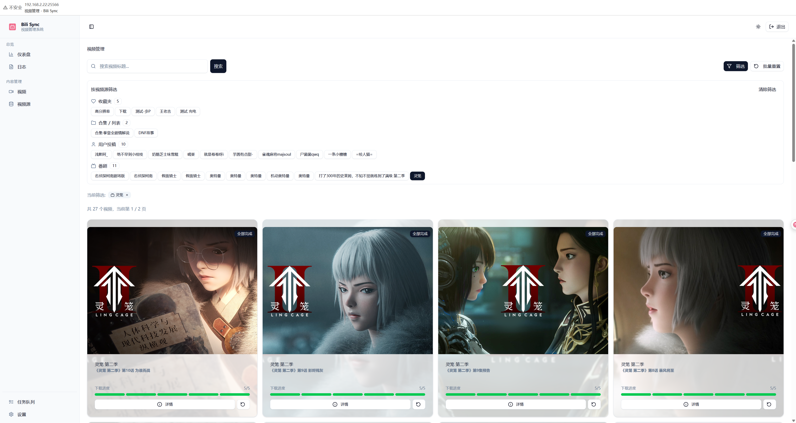
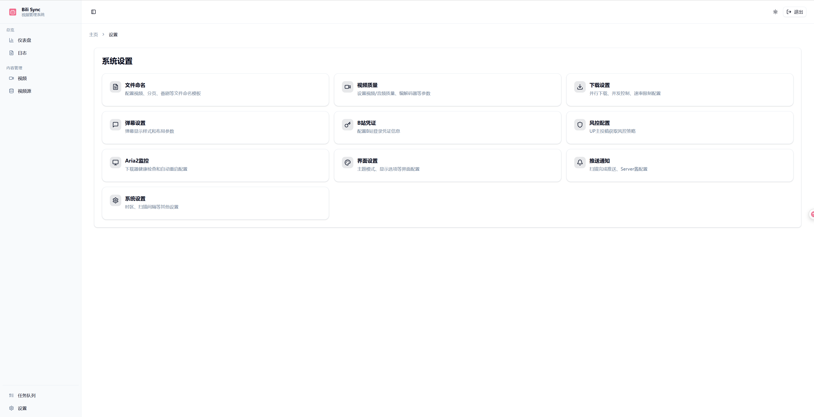

# 使用教程

## 1. 首次登录

打开浏览器访问 `http://localhost:12345`

## 2. 扫码登录

点击右上角头像 → 扫码登录 → 使用B站APP扫码

## 3. 添加下载源

### 添加收藏夹
1. 点击"添加视频源"
2. 选择"收藏夹"
3. 选择要下载的收藏夹
4. 点击确定

### 添加UP主
1. 点击"添加视频源"
2. 选择"UP主"
3. 输入UP主ID或主页链接
4. 点击确定

### 添加番剧
1. 点击"添加视频源"
2. 选择"番剧"
3. 输入番剧链接
4. 选择要下载的季度

## 4. 查看下载进度

- 首页显示实时下载进度
- "任务队列"页面查看详细状态

## 5. 管理已下载视频

- "视频"页面查看所有已下载内容
- 支持搜索、筛选、播放
- 可以删除不需要的视频

## 6. 系统设置

点击"系统设置"可以配置：
- 下载路径
- 扫描间隔
- 视频质量
- 并发数量

## 小技巧

- 支持批量添加多个收藏夹
- 番剧支持选择特定季度下载
- UP主视频支持按时间过滤
- 所有下载任务都支持暂停/恢复